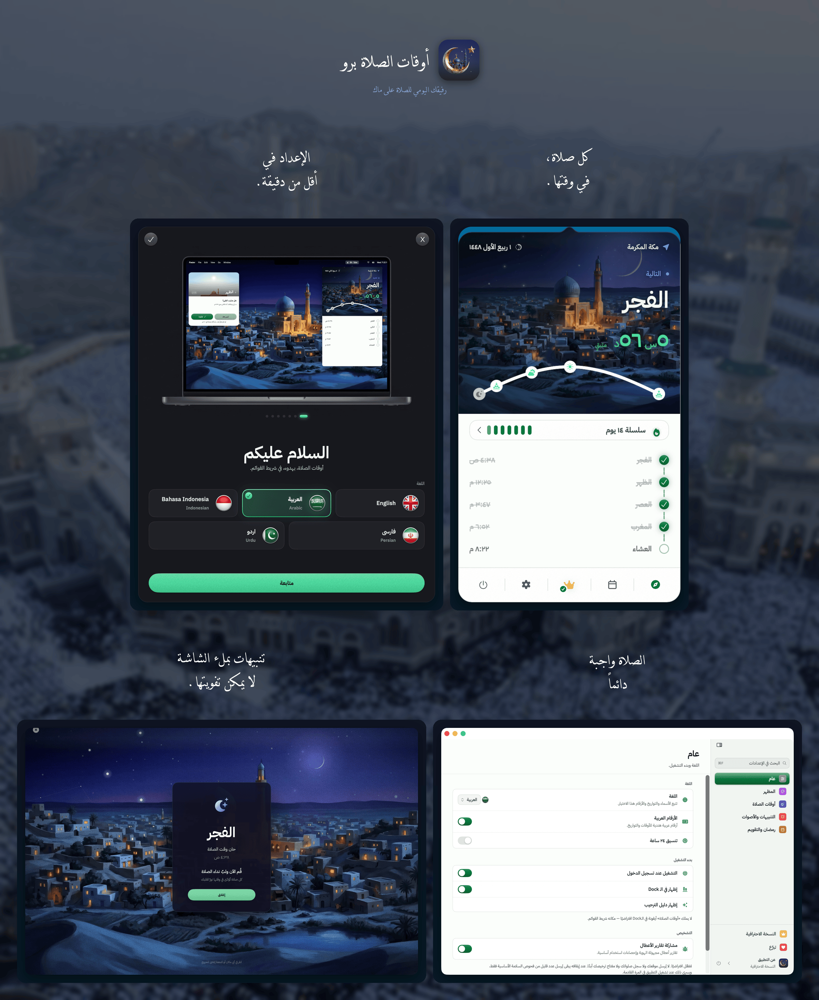
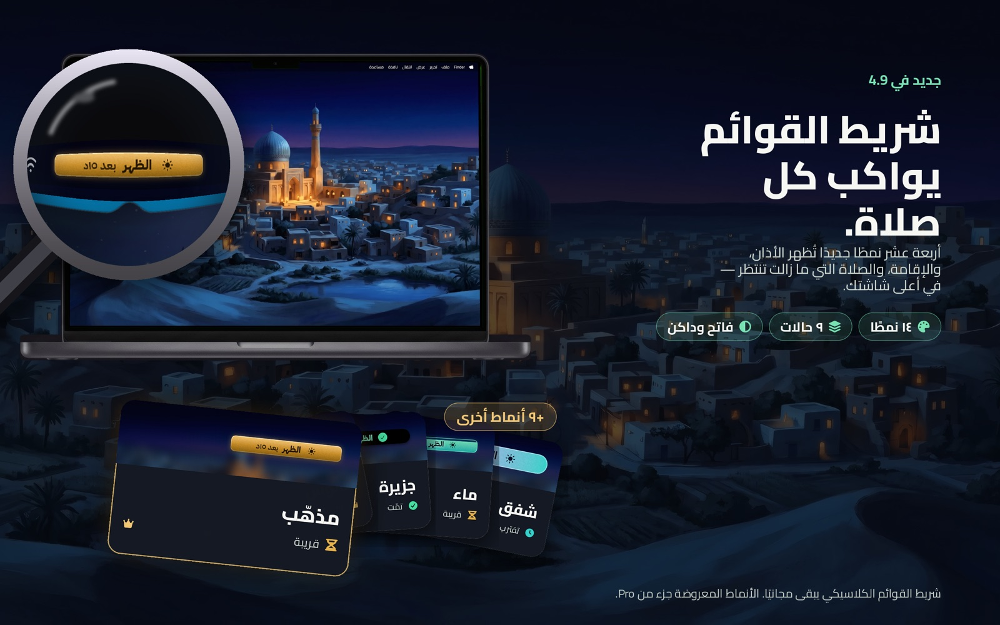
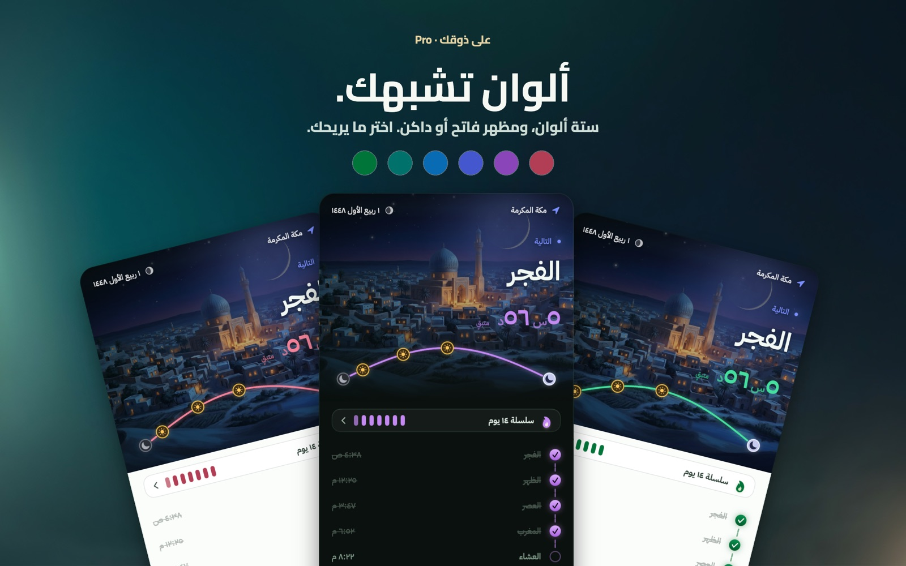
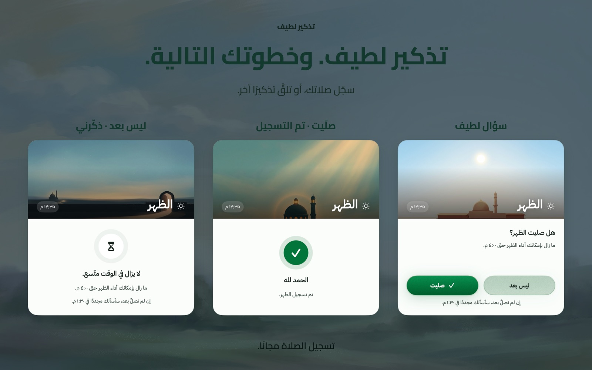
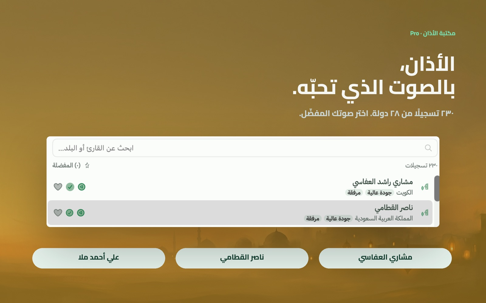

<!-- BEGIN abd3lraouf-studios:hero -->

    <a href="README.md">English</a> | <strong>العربية</strong> | <a href="README.fa.md">فارسی</a> | <a href="README.id.md">Bahasa Indonesia</a> | <a href="README.ur.md">اردو</a>

    

<h1 align="center">أوقات الصلاة برو</h1>

    <strong>تطبيق بسيط وخاص بالكامل لأوقات الصلاة الإسلامية يعيش في شريط القوائم على جهاز ماك.</strong> 
    حساب أوقات الصلاة دون اتصال · 26 طريقة · 5 لغات · يدعم Apple Silicon و Intel

    

    <a href="https://abd3lraouf.dev/download/prayertimes/macos"><strong>حمّل النسخة المباشرة →</strong></a>

    <a href="https://abd3lraouf.dev/projects/prayertimes/">abd3lraouf.dev/projects/prayertimes/</a>

<!-- END abd3lraouf-studios:hero -->

    
    

    
    
    
    

    

---

## لماذا أوقات الصلاة برو؟

- **خاص افتراضيًا** — بلا حسابات، ولا شيء يتعقّبك عبر التطبيقات أو الويب. تُحسب أوقات الصلاة على جهازك، ولا يُرسَل موقعك الدقيق أبدًا. ويمكن إيقاف التشخيصات المجهولة من الإعدادات ← عام ← التشخيص.
- **مصمم لشريط القوائم** — مرئي دائمًا، ولا يزعجك أبدًا. عرض عدّ تنازلي أو وقت محدّد أو مختصر أو أيقونة فقط.
- **دقيق في كل العالم** — 26 طريقة حساب، تعديلات لكل صلاة، زوايا مخصصة.
- **يعمل دون اتصال** — تُحسب أوقات الصلاة على جهازك، فتبقى تعمل حتى دون اتصال بالإنترنت.

## نظرة أقرب

<table>
<tr>
<td width="50%" align="center"> <b>جديد في 4.9</b> — أربعة عشر نمطًا لشريط القوائم تُظهر الأذان والإقامة والصلاة التي لم تُسجَّل بعد.</td>
<td width="50%" align="center"> ستة ألوان مميزة، بالمظهرين الفاتح والداكن.</td>
</tr>
<tr>
<td width="50%" align="center"> نافذة لطيفة تسألك إن كنت صليت.</td>
<td width="50%" align="center"> 230 تسجيلًا للأذان من 28 دولة.</td>
</tr>
</table>

## التثبيت

**المتطلبات:** macOS 14 (Sonoma) أو أحدث · يدعم Apple Silicon و Intel

يصدر أوقات الصلاة برو عبر قناتين، وكلتاهما التطبيق نفسه بالسعر نفسه — اختر ما يناسبك.

**ماك آب ستور** — تتولّى Apple عملية الشراء والتحديثات.

**التنزيل المباشر** — نسخة موقّعة ومصدّقة من Apple، تُحدّث نفسها، ويُفتَح فيها برو بمفتاح ترخيص يبقى معك.

- [نزّل أحدث ملف DMG](https://abd3lraouf.dev/download/prayertimes/macos)
- أو عبر Homebrew: `brew install --cask abd3lraouf-studios/tap/prayertimes`

## المزايا

- **عدّ تنازلي** في شريط القوائم، أو الوقت المحدّد، أو عرض مختصر، أو أيقونة فقط
- **إشعارات** قبل الصلاة وعند دخول وقتها، مع إمكانية التنبيه على كامل الشاشة
- **أربعة عشر نمطًا لشريط القوائم** تُظهر الأذان والإقامة والصلاة التي لم تُسجَّل بعد بنظرة واحدة — ويبقى شريط القوائم الكلاسيكي مجانيًا
- **تنبيه الإقامة** — تُرفع الإقامة بعد الأذان بعدد الدقائق الذي تختاره لكل صلاة: «قد قامت الصلاة» قصيرة، أو إقامة كاملة من بين خمسة عشر تسجيلًا
- **سؤال الصلاة** — نافذة لطيفة تسألك إن كنت صليت، وتعود إليك ما دام وقت الصلاة قائمًا
- **تذكير الصلاة على النبي ﷺ** — «اللهم صلِّ على محمد» مسموعة كل فترة تختارها، وتصمت في ساعات الهدوء
- **أربع سماوات مرسومة** خلف كل صلاة، وساعة هادئة بملء الشاشة لشاشة إضافية
- **26 طريقة حساب**: رابطة العالم الإسلامي (MWL)، الجمعية الإسلامية لأمريكا الشمالية (ISNA)، الهيئة العامة المصرية، أم القرى (مكة المكرمة)، الديانة (تركيا)، كمناغ (إندونيسيا)، كراتشي، طهران، دبي، قطر، سنغافورة، الكويت، الجزائر، فرنسا، ألمانيا، ماليزيا (JAKIM)، وغيرها
- **تحديد الموقع تلقائيًا أو يدويًا** · تعديلات وقت لكل صلاة لمطابقة مسجدك المحلي
- **التقويم الهجري** بإمكانية ضبط التاريخ وإشعارات بالأحداث الإسلامية (رمضان، عيد الفطر، عيد الأضحى، رأس السنة الهجرية، يوم عاشوراء، وغيرها)
- **وضع رمضان**: إشعارات السحور والإفطار مع تنبيهات مسبقة
- **سجل الصلوات** — علّم كل صلاة عند أدائها، مع بداية يوم مرتبطة بالفجر، وسلاسل مواظبة، وتتبّع للقضاء
- **السنن والنوافل** إلى جانب الفرائض الخمس
- **بوصلة القبلة** تشير إلى الكعبة من حيث كنت
- **مكتبة الأذان** — تسجيلات من 28 دولة، مع أذان منفصل للفجر، وساعات هدوء، وإعدادات تأجيل، وإعلانات لكل صلاة
- **أحضر مؤذنك** — استخدم تسجيلًا تحبّه، واختر مؤذنًا لكل صلاة، واقتطع بدايته حيث تشاء
- **أداة أوقات الصلاة** لسطح المكتب ومركز الإشعارات
- **مزامنة iCloud** — يتنقّل سجل صلواتك وتفضيلاتك بين أجهزة ماك، مع التصدير ومراجعة السنة
- **إعدادات تجد نفسها** — نافذة بقائمة جانبية وبحث يشمل كل الأقسام
- **أرقام محلية** (هندية عربية، هندية عربية ممتدة، غربية)
- **5 لغات**: English، العربية، Bahasa Indonesia، فارسی، اردو — مع دعم كامل لاتجاه RTL
- **الوضع الفاتح/الداكن** يتبع نظامك تلقائيًا، مع إمكانية تجاوز المظهر واختيار لون التمييز
- **إتاحة الوصول** — دعم Dynamic Type وزيادة التباين وتقليل الحركة في التطبيق كله

## مجاني وبرو

تنزيل أوقات الصلاة برو مجاني على القناتين، وجوهر التطبيق يبقى مجانيًا دائمًا: العدّ التنازلي في شريط القوائم، وطرق الحساب الست والعشرين كلها، وتعديلات كل صلاة، والإشعارات والتنبيهات على كامل الشاشة والأذان نفسه، والتقويم الهجري وتذكيراته بالمناسبات، ووضع رمضان، وبوصلة القبلة، وتعليم كل صلاة عند أدائها، واختصار Siri والاختصارات، والمظهرين الفاتح والداكن. هذا تطبيق أوقات صلاة متكامل، ولا يكلّفك شيئًا.

وسؤال الصلاة، وتذكير الصلاة على النبي ﷺ، وإقامة قصيرة بعد كل صلاة، وشريط القوائم الكلاسيكي مجانية كذلك.

ويضيف **فتح برو لمرة واحدة مقابل 14.99 دولارًا** ثلاثة أشياء:

- **السماء الحيّة** — سماء متحركة خلف العدّ التنازلي في أربعة مشاهد مرسومة، وقوس مسار الشمس عبر اليوم، ومدفع رمضان، وأربعة عشر نمطًا لشريط القوائم، وساعة هادئة بملء الشاشة لشاشة إضافية، وكل ألوان التمييز.
- **كل أصوات الأذان والإقامة** — مكتبة الأذان الكاملة المسجّلة في 28 دولة، وأذان منفصل للفجر، وكل تسجيلات الإقامة، وصوت التنبيه المنطوق قبل الصلاة.
- **المواظبة والقضاء** — تقويم سلاسل المواظبة وسجلّاتها، وقائمة السنن، ودفتر ما عليك قضاؤه.

دفعة واحدة، بلا اشتراك وبلا حساب. في آب ستور يبقى الشراء مرتبطًا بحساب Apple الخاص بك، وفي النسخة المباشرة يبقى مع مفتاح الترخيص.

## الخصوصية

لا إعلانات، ولا حسابات، ولا شيء يتعقّبك عبر التطبيقات أو الويب. تُحسب أوقات الصلاة بالكامل على جهازك، ولا يُرسَل موقعك **الدقيق** أبدًا. وما يخرج فعلًا من جهازك: إحصاءات استخدام مجهولة الهوية — ولا يشمل ذلك أبدًا موقعك ولا سجل صلواتك، ويمكن إيقافه كله بنقرة واحدة من الإعدادات ← عام ← التشخيص. وإذا فعّلت مزامنة iCloud، ينتقل سجل صلواتك وتفضيلاتك عبر **iCloud الخاص بك** إلى أجهزة ماك الأخرى — لا عبر أي خادم لنا. وهي معطّلة حتى تفعّلها بنفسك.

لعرض اسم المدينة بدل الإحداثيات، يُقرَّب موقعك إلى نحو 1.1 كم ويُطلب الاسم من خدمة تحديد المواقع لدى Apple. أما إرسال هذا الموقع المقرَّب إلى **OpenStreetMap Nominatim** — وهو ما تحتاجه الإندونيسية والفارسية والأردية للحصول على اسم مكتوب بشكل صحيح — فهو **معطَّل افتراضيًا** ويمكن تفعيله من «أوقات الصلاة ← الموقع». وعند كتابة اسم مدينة في منتقي الموقع يُرسَل النص الذي تكتبه فقط. تُنزَّل مقاطع أذان برو عند الطلب من Internet Archive. وتصل تحديثات نسخة آب ستور عبر آب ستور، بينما تبحث النسخة المباشرة عن تحديثاتها بنفسها.

## ماذا يمكنك أن تفعل هنا

- 🐛 [**القضايا**](https://github.com/abd3lraouf-studios/PrayerTimes/issues) — أبلغ عن خطأ أو اطلب ميزة، أو [أنشئ قضية جديدة](https://github.com/abd3lraouf-studios/PrayerTimes/issues/new/choose).
- 💬 [**النقاشات**](https://github.com/abd3lraouf-studios/PrayerTimes/discussions) — اطرح الأسئلة، شارك الأفكار، وتحدّث مع المستخدمين.
- 📚 [**الويكي**](https://github.com/abd3lraouf-studios/PrayerTimes/wiki) — أدلّة، أسئلة شائعة، ومعرفة مشتركة.

إذا واجهتك مشكلة أو لديك طلب، ابحث أولًا في [القضايا](https://github.com/abd3lraouf-studios/PrayerTimes/issues)، ثم [أنشئ قضية جديدة](https://github.com/abd3lraouf-studios/PrayerTimes/issues/new/choose). للنقاشات العامة، توجّه إلى [النقاشات](https://github.com/abd3lraouf-studios/PrayerTimes/discussions).

## ادعم التطوير

أوقات الصلاة برو مبني ومُصان على يد مطوّر واحد في وقت فراغه. إذا كان مفيدًا لك، ندعوك لدعم التطوير:

    
    
    

كلّ مساهمة — مهما كانت صغيرة — تساعد في إبقاء التطبيق قيد التطوير النشط، وخاليًا من الإعلانات والمتعقّبات والحسابات.

## المواد الصحفية والتسويقية

الحقيبة الصحفية — الأيقونات، وصور الشاشات، والنصوص التعريفية، وورقة الحقائق، وأرشيف قابل للتنزيل — متاحة على **[abd3lraouf.dev/press/prayertimes/](https://abd3lraouf.dev/press/prayertimes/)**.

## الترخيص

أوقات الصلاة برو **مغلق المصدر**. يستضيف هذا المستودع القضايا والنقاشات والمواد الصحفية فقط. يُوزَّع التطبيق وفق اتفاقية ترخيص المستخدم النهائي الخاصة به — انظر [قائمة ماك آب ستور](https://apps.apple.com/eg/app/prayer-times-pro-menubar/id6763390896?mt=12) أو [صفحة المنتج](https://abd3lraouf.dev/projects/prayertimes/).
