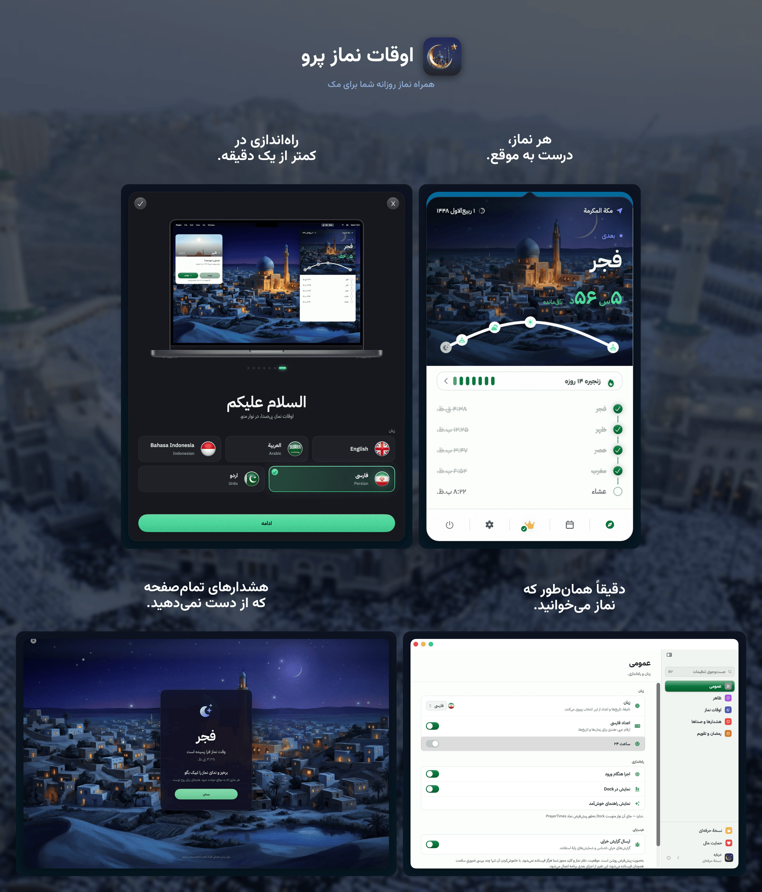

<!-- BEGIN abd3lraouf-studios:hero -->

    <a href="README.md">English</a> | <a href="README.ar.md">العربية</a> | <strong>فارسی</strong> | <a href="README.id.md">Bahasa Indonesia</a> | <a href="README.ur.md">اردو</a>

    

<h1 align="center">اوقات نماز پرو</h1>

    <strong>یک برنامهٔ مینیمال و حافظ حریم خصوصی برای اوقات شرعی نماز که در نوار منوی مک شما زندگی می‌کند.</strong> 
    محاسبهٔ آفلاین اوقات نماز · ۲۶ روش · ۵ زبان · Apple Silicon و Intel

    

    <a href="https://abd3lraouf.dev/download/prayertimes/macos"><strong>دانلود نسخهٔ مستقیم →</strong></a>

    <a href="https://abd3lraouf.dev/projects/prayertimes/">abd3lraouf.dev/projects/prayertimes/</a>

<!-- END abd3lraouf-studios:hero -->

    
    

    
    
    
    

    

---

## چرا اوقات نماز پرو؟

- **به‌صورت پیش‌فرض خصوصی** — بدون حساب کاربری، و بدون هیچ چیزی که شما را در میان برنامه‌ها یا وب دنبال کند. اوقات نماز روی مک شما محاسبه می‌شود و موقعیت دقیق شما هرگز ارسال نمی‌شود. تشخیص‌های ناشناس را می‌توان از تنظیمات ← عمومی ← عیب‌یابی خاموش کرد.
- **طراحی‌شده برای نوار منو** — همیشه قابل‌مشاهده، هرگز مزاحم نیست. شمارش معکوس، زمان دقیق، فشرده، یا فقط آیکون.
- **در سراسر جهان دقیق** — ۲۶ روش محاسبه، تنظیمات جداگانه برای هر نماز، زاویه‌های سفارشی.
- **نخست-آفلاین** — اوقات نماز روی مک شما محاسبه می‌شوند، پس بدون اتصال هم کار می‌کنند.

## نگاهی نزدیک‌تر

<table>
<tr>
<td width="50%" align="center"> <b>تازه در ۴٫۹</b> — چهارده سبک نوار منو که اذان، اقامه و نمازِ هنوز ثبت‌نشده را نشان می‌دهند.</td>
<td width="50%" align="center"> شش رنگ شاخص، در حالت روشن و تیره.</td>
</tr>
<tr>
<td width="50%" align="center"> پنجره‌ای آرام می‌پرسد نماز خوانده‌اید یا نه.</td>
<td width="50%" align="center"> ۲۳۰ ضبط اذان از ۲۸ کشور.</td>
</tr>
</table>

## نصب

**نیازمندی‌ها:** macOS 14 (Sonoma) یا بالاتر · Apple Silicon و Intel

اوقات نماز پرو از دو مسیر عرضه می‌شود؛ هر دو یک برنامه با یک قیمت — هر کدام را که می‌پسندید بردارید.

**Mac App Store** — خرید و به‌روزرسانی را Apple انجام می‌دهد.

**دانلود مستقیم** — امضاشده و تأییدشده، خودش به‌روز می‌شود، و پرو با کلید مجوزی باز می‌شود که مال خودتان می‌ماند.

- [دانلود آخرین فایل DMG](https://abd3lraouf.dev/download/prayertimes/macos)
- یا با Homebrew: `brew install --cask abd3lraouf-studios/tap/prayertimes`

## امکانات

- **شمارش معکوس** در نوار منو، زمان دقیق، نمایش فشرده، یا فقط آیکون
- **اعلان‌ها** پیش از نماز و در زمان نماز، با گزینهٔ هشدار تمام‌صفحه
- **چهارده سبک نوار منو** که اذان، اقامه و نمازِ هنوز ثبت‌نشده را در یک نگاه نشان می‌دهند — نوار منوی کلاسیک رایگان می‌ماند
- **هشدار اقامه** — اقامه چند دقیقهٔ دلخواه پس از اذان، برای هر نماز جداگانه پخش می‌شود: «قد قامت الصلاة» کوتاه، یا اقامهٔ کامل از میان پانزده ضبط
- **پرسش نماز** — پنجره‌ای آرام می‌پرسد نماز خوانده‌اید یا نه، و تا وقت نماز باقی است دوباره می‌پرسد
- **یادآور صلوات** — «اللهم صلّ علی محمد» با صدا، در فاصله‌ای که خودتان برمی‌گزینید، و خاموش در ساعات سکوت
- **چهار آسمان نقاشی‌شده** پشت هر نماز، و ساعتی آرام و تمام‌صفحه برای یک صفحه‌نمایش اضافی
- **۲۶ روش محاسبه**: اتحادیهٔ جهانی مسلمین (MWL)، ISNA، سازمان عمومی مصر، ام‌القری (مکه)، دیانت (ترکیه)، کمناغ (اندونزی)، کراچی، تهران، دبی، قطر، سنگاپور، کویت، الجزایر، فرانسه، آلمان، مالزی (JAKIM)، و موارد دیگر
- **مکان خودکار یا دستی** · تنظیم جداگانه برای هر نماز جهت تطبیق با مسجد محلی شما
- **تقویم هجری** با تاریخ قابل تنظیم و اعلان رویدادهای اسلامی (رمضان، عید فطر، عید قربان، سال نوی هجری، روز عاشورا و موارد دیگر)
- **حالت رمضان**: اعلان‌های سحری و افطار با هشدارهای پیش از موعد
- **دفتر نماز** — هر نماز را هنگام خواندن علامت بزنید، با آغاز روز بر پایهٔ اذان صبح، زنجیرهٔ مداومت، و پیگیری قضا
- **سنت و نوافل** در کنار پنج نماز واجب
- **قطب‌نمای قبله** که از هر کجا باشید به کعبه اشاره می‌کند
- **کتابخانهٔ اذان** — مجموعه‌ای از ضبط‌های ۲۸ کشور، با اذان جداگانه برای صبح، ساعات سکوت، تنظیمات تعویق، و اعلام جداگانه برای هر نماز
- **مؤذن خودتان را بیاورید** — از ضبطی که دوست دارید استفاده کنید، برای هر نماز مؤذنی جداگانه برگزینید، و آغازش را هرجا خواستید کوتاه کنید
- **ابزارک اوقات نماز** برای میزکار و مرکز اعلان‌ها
- **همگام‌سازی iCloud** — دفتر نماز و تنظیمات شما میان مک‌ها همراهتان می‌آید، همراه با خروجی گرفتن و مرور سال
- **تنظیماتی که خودشان پیدا می‌شوند** — پنجره‌ای با نوار کناری و جست‌وجو در همهٔ بخش‌ها
- **اعداد محلی** (هندی-عربی، هندی-عربی گسترده، غربی)
- **۵ زبان**: English، العربية، Bahasa Indonesia، فارسی، اردو — با پشتیبانی کامل از RTL
- **حالت روشن/تاریک** از تنظیمات سیستم پیروی می‌کند، با امکان بازنویسی ظاهر و انتخاب رنگ تأکید
- **دسترس‌پذیری** — پشتیبانی از Dynamic Type، Increase Contrast و Reduce Motion در سراسر برنامه

## رایگان و پرو

دانلود اوقات نماز پرو از هر دو مسیر رایگان است و قلب برنامه برای همیشه رایگان می‌ماند: شمارش معکوس در نوار منو، هر ۲۶ روش محاسبه، تنظیمات جداگانهٔ هر نماز، اعلان‌ها و هشدارهای تمام‌صفحه و خودِ اذان، تقویم هجری و یادآوری رویدادهایش، حالت رمضان، قطب‌نمای قبله، ثبت هر نماز هنگام خواندن آن، میان‌بر Siri و Shortcuts، و پوسته‌های روشن و تیره. این یک برنامهٔ کامل اوقات نماز است و هیچ هزینه‌ای ندارد.

پرسش نماز، یادآور صلوات، اقامهٔ کوتاه پس از هر نماز و نوار منوی کلاسیک هم رایگان‌اند.

**بازگشایی پروی ۱۴٫۹۹ دلاری، یک‌بار برای همیشه** سه چیز را اضافه می‌کند:

- **آسمان زنده** — آسمانی متحرک پشت شمارش معکوس در چهار صحنهٔ نقاشی‌شده، کمان مسیر خورشید در طول روز، توپ رمضان، چهارده سبک نوار منو، ساعتی آرام و تمام‌صفحه برای صفحه‌نمایش اضافی، و همهٔ رنگ‌های تأکید.
- **همهٔ مؤذن‌ها و اقامه‌ها** — کتابخانهٔ کامل اذان ضبط‌شده در ۲۸ کشور، اذان جداگانه برای صبح، همهٔ ضبط‌های اقامه، و صدای یادآوری گفتاری پیش از نماز.
- **مداومت و قضا** — تقویم و سوابق زنجیرهٔ مداومت، سیاههٔ سنّت‌ها، و دفتر قضا.

یک پرداخت، بدون اشتراک، بدون حساب کاربری. خرید از App Store با حساب Apple شما می‌ماند و خرید نسخهٔ مستقیم با کلید مجوزتان.

## حریم خصوصی

بدون تبلیغات، بدون حساب کاربری، و بدون هیچ چیزی که شما را در میان برنامه‌ها یا وب ردیابی کند. اوقات نماز کاملاً روی مک شما محاسبه می‌شود و موقعیت **دقیق** شما هرگز ارسال نمی‌شود. آنچه واقعاً از مک خارج می‌شود: شمارش‌های استفادهٔ ناشناس از هر دو نسخه، و گزارش‌های کرش ناشناس از دانلود مستقیم — هرگز موقعیت مکانی، دفتر نماز یا کلید مجوز شما، و همهٔ اینها با یک لمس در تنظیمات ← عمومی ← عیب‌یابی خاموش می‌شود. اگر همگام‌سازی iCloud را روشن کنید، دفتر نماز و تنظیمات شما نیز از راه **iCloud خودتان** به مک‌های دیگرتان می‌رود — نه از راه سرور ما. تا وقتی خودتان روشنش نکنید خاموش است.

برای نمایش نام شهر به‌جای مختصات خام، موقعیت شما به حدود ۱٫۱ کیلومتر گرد می‌شود و نام از سرویس مکان‌یابی Apple گرفته می‌شود. ارسال همین مختصات گردشده به **OpenStreetMap Nominatim** — که اندونزیایی، فارسی و اردو برای نامی درست به آن نیاز دارند — **به‌صورت پیش‌فرض خاموش است** و از «اوقات نماز ← موقعیت» فعال می‌شود. هنگام تایپ نام شهر در انتخابگر موقعیت، فقط متنی که می‌نویسید ارسال می‌شود. صداهای Pro (کلیپ‌های اذان و قاریان اذکار) در صورت نیاز از سرور خود برنامه دانلود می‌شوند، که ابتدا فعال بودن Pro را بررسی می‌کند. نسخهٔ App Store از راه App Store به‌روز می‌شود و نسخهٔ مستقیم خودش به‌روزرسانی‌هایش را بررسی می‌کند.

توقف پخش رسانه هنگام اذان اختیاری است. وقتی آن را در حریم خصوصی و امنیت ← خودکارسازی اجازه دهید، برنامه از Music، TV یا Spotify — فقط آن که در حال اجراست — می‌پرسد که آیا در حال پخش است، و از آن می‌خواهد مکث کند و دوباره پخش کند؛ و نه چیز دیگری. حالت سفر خانه و مکان فعلی شما را روی همین مک نگه می‌دارد؛ هیچ‌کدام همگام‌سازی یا ارسال نمی‌شود.

## این‌جا چه می‌توانید بکنید

- 🐛 [**Issues**](https://github.com/abd3lraouf-studios/PrayerTimes/issues) — یک باگ گزارش کنید یا ویژگی درخواست بدهید، یا [مورد جدید بسازید](https://github.com/abd3lraouf-studios/PrayerTimes/issues/new/choose).
- 💬 [**Discussions**](https://github.com/abd3lraouf-studios/PrayerTimes/discussions) — سؤال بپرسید، ایده به اشتراک بگذارید و با کاربران دیگر گفت‌وگو کنید.
- 📚 [**Wiki**](https://github.com/abd3lraouf-studios/PrayerTimes/wiki) — راهنماها، پرسش‌های متداول و دانش مشترک.

اگر مشکلی دارید یا درخواستی، ابتدا در [Issues](https://github.com/abd3lraouf-studios/PrayerTimes/issues) جست‌وجو کنید، سپس [مورد جدید باز کنید](https://github.com/abd3lraouf-studios/PrayerTimes/issues/new/choose). برای گفت‌وگوی عمومی به [Discussions](https://github.com/abd3lraouf-studios/PrayerTimes/discussions) بروید.

## از توسعه پشتیبانی کنید

اوقات نماز پرو توسط یک توسعه‌دهنده در اوقات فراغت ساخته و نگهداری می‌شود. اگر برایتان مفید است، لطفاً پشتیبانی از توسعه را در نظر بگیرید:

    
    
    

هر کمکی — هر چقدر هم کوچک — به فعال ماندن توسعهٔ برنامه و عاری بودن آن از تبلیغات، ردیاب‌ها و حساب‌های کاربری کمک می‌کند.

## مواد مطبوعاتی و بازاریابی

کیت مطبوعاتی — آیکون‌ها، تصاویر صفحه، متن‌های معرفی، برگهٔ اطلاعات و یک بایگانی قابل دانلود — در **[abd3lraouf.dev/press/prayertimes/](https://abd3lraouf.dev/press/prayertimes/)** در دسترس است.

## مجوز

اوقات نماز پرو **متن‌بسته (closed source)** است. این مخزن فقط میزبان Issues، Discussions و مواد مطبوعاتی است. برنامه تحت توافق‌نامهٔ مجوز کاربر نهایی خود توزیع می‌شود — به [فهرست Mac App Store](https://apps.apple.com/eg/app/prayer-times-pro-menubar/id6763390896?mt=12) یا [صفحهٔ محصول](https://abd3lraouf.dev/projects/prayertimes/) مراجعه کنید.
