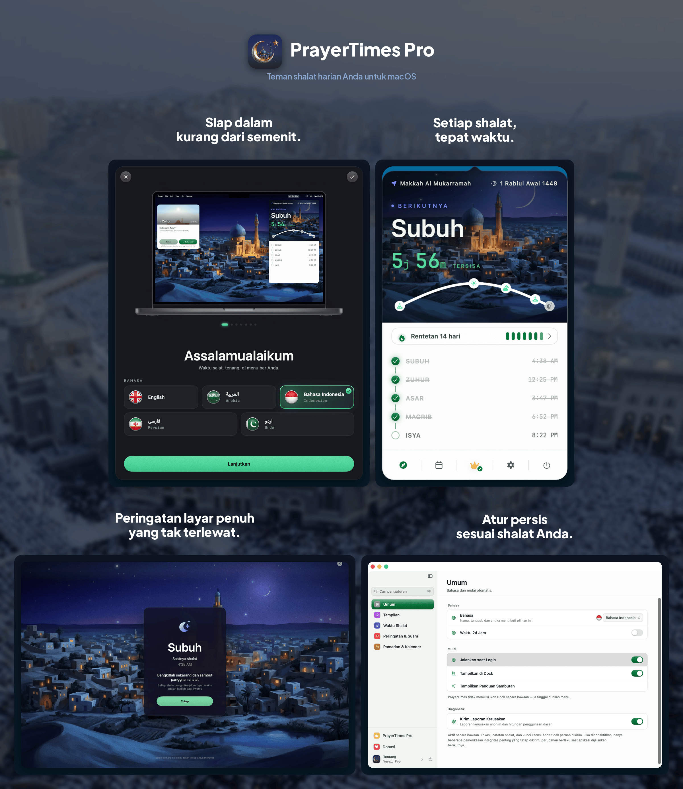
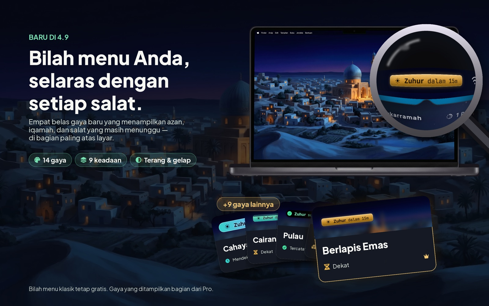
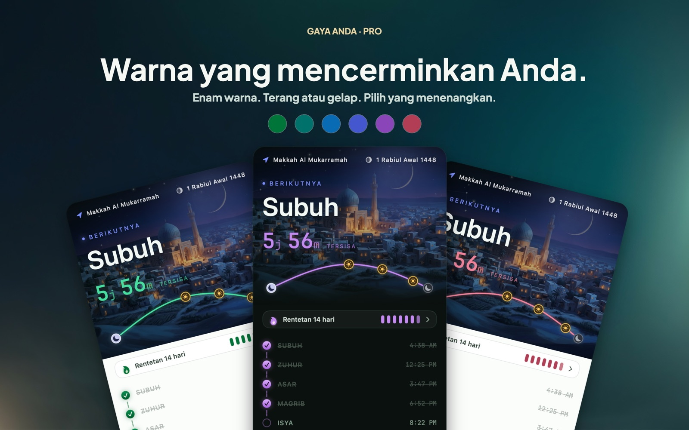
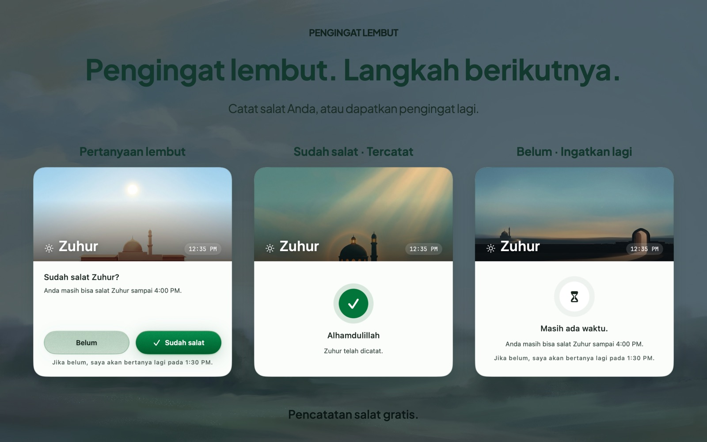
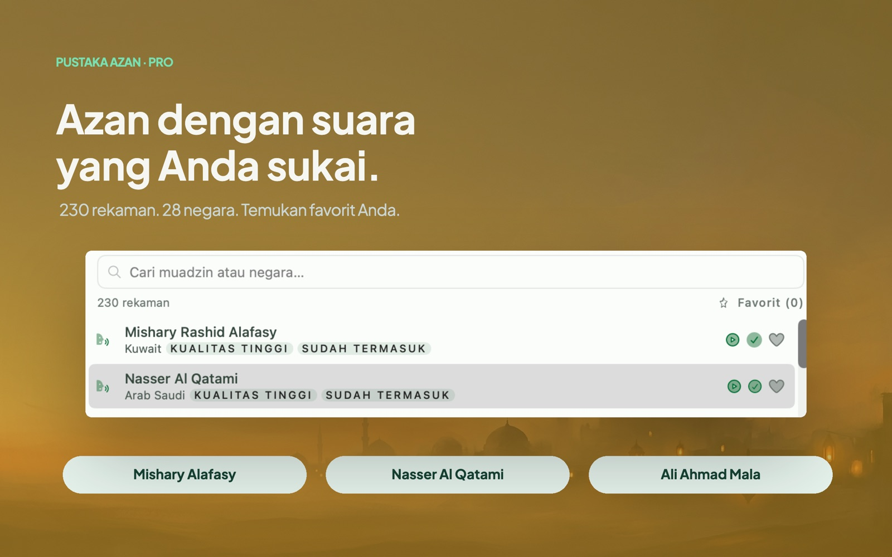

<!-- BEGIN abd3lraouf-studios:hero -->

    <a href="README.md">English</a> | <a href="README.ar.md">العربية</a> | <a href="README.fa.md">فارسی</a> | <strong>Bahasa Indonesia</strong> | <a href="README.ur.md">اردو</a>

    

<h1 align="center">PrayerTimes Pro</h1>

    <strong>Aplikasi waktu shalat minimalis yang mengutamakan privasi, tinggal di menu bar Mac Anda.</strong> 
    Perhitungan waktu salat offline · 26 metode · 5 bahasa · Apple Silicon & Intel

    

    <a href="https://abd3lraouf.dev/download/prayertimes/macos"><strong>Unduh versi langsung →</strong></a>

    <a href="https://abd3lraouf.dev/projects/prayertimes/">abd3lraouf.dev/projects/prayertimes/</a>

<!-- END abd3lraouf-studios:hero -->

    
    

    
    
    
    

    

---

## Mengapa PrayerTimes Pro?

- **Privat secara bawaan** — tanpa akun, dan tanpa apa pun yang mengikuti Anda lintas aplikasi atau web. Waktu salat dihitung di Mac Anda, dan lokasi presisi Anda tidak pernah dikirim. Diagnostik anonim dapat dimatikan di Pengaturan → Umum → Diagnostik.
- **Dirancang untuk menu bar** — selalu terlihat, tidak pernah mengganggu. Hitung mundur, waktu pasti, ringkas, atau hanya ikon.
- **Akurat di seluruh dunia** — 26 metode perhitungan, penyesuaian per shalat, sudut khusus.
- **Offline-first** — waktu shalat dihitung di Mac Anda, jadi tetap berfungsi tanpa koneksi.

## Lebih dekat

<table>
<tr>
<td width="50%" align="center"> <b>Baru di 4.9</b> — empat belas gaya menu bar yang menampilkan adzan, iqamah, dan shalat yang belum dicatat.</td>
<td width="50%" align="center"> Enam warna aksen, dalam mode terang dan gelap.</td>
</tr>
<tr>
<td width="50%" align="center"> Jendela yang lembut menanyakan apakah Anda sudah shalat.</td>
<td width="50%" align="center"> 230 rekaman adzan dari 28 negara.</td>
</tr>
</table>

## Instalasi

**Persyaratan:** macOS 14 (Sonoma) atau lebih baru · Apple Silicon & Intel

PrayerTimes Pro hadir lewat dua kanal. Aplikasi yang sama dengan harga yang sama — pilih yang paling cocok untuk Anda.

**Mac App Store** — pembelian dan pembaruan ditangani Apple.

**Unduhan langsung** — sudah ditandatangani dan dinotarisasi, memperbarui dirinya sendiri, dan Pro dibuka dengan kunci lisensi yang menjadi milik Anda.

- [Unduh berkas DMG terbaru](https://abd3lraouf.dev/download/prayertimes/macos)
- Atau lewat Homebrew: `brew install --cask abd3lraouf-studios/tap/prayertimes`

## Fitur

- **Hitung mundur** di menu bar, waktu pasti, tampilan ringkas, atau hanya ikon
- **Notifikasi** sebelum dan saat waktu shalat, dengan opsi peringatan layar penuh
- **Empat belas gaya menu bar** yang menampilkan adzan, iqamah, dan shalat yang belum dicatat dalam sekejap — menu bar klasik tetap gratis
- **Pengingat iqamah** — iqamah diputar beberapa menit setelah adzan, sesuai pilihan Anda untuk setiap shalat: "Qad qāmatis-ṣalāh" singkat atau iqamah lengkap dari lima belas rekaman
- **Check-in shalat** — jendela yang lembut menanyakan apakah Anda sudah shalat, dan bertanya lagi selama waktu shalat masih ada
- **Pengingat shalawat** — "Allahumma shalli 'ala Muhammad" yang dilantunkan pada selang waktu pilihan Anda, dan diam selama jam tenang
- **Empat langit lukisan** di balik setiap shalat, dan jam layar penuh yang tenang untuk layar cadangan
- **26 metode perhitungan**: Muslim World League (MWL), ISNA, Otoritas Umum Mesir, Umm al-Qura (Makkah), Diyanet (Turki), Kemenag (Indonesia), Karachi, Tehran, Dubai, Qatar, Singapura, Kuwait, Aljazair, Prancis, Jerman, Malaysia (JAKIM), dan lainnya
- **Lokasi otomatis atau manual** · penyesuaian waktu per shalat untuk menyesuaikan masjid setempat
- **Kalender Hijriah** dengan tanggal yang dapat disesuaikan dan notifikasi peristiwa Islam (Ramadan, Idul Fitri, Idul Adha, Tahun Baru Hijriah, Hari Asyura, dan lainnya)
- **Mode Ramadan**: notifikasi Sahur dan Berbuka dengan peringatan dini
- **Catatan shalat** — tandai setiap shalat saat Anda menunaikannya, dengan pergantian hari berpatokan Subuh, rentetan (streak), dan pelacakan qada
- **Sunnah & Nawafil** di samping lima shalat wajib
- **Kompas kiblat** yang mengarah ke Ka'bah dari mana pun Anda berada
- **Pustaka adzan** — koleksi rekaman dari 28 negara, dengan adzan terpisah untuk Subuh, jam senyap, setelan tunda, dan pengumuman per shalat
- **Bawa muazin Anda sendiri** — pakai rekaman yang Anda sukai, beri setiap shalat muazinnya sendiri, dan pangkas awalnya sesuai keinginan
- **Widget waktu shalat** untuk desktop dan Pusat Notifikasi
- **Sinkronisasi iCloud** — catatan shalat dan preferensi Anda mengikuti antar-Mac, dengan ekspor dan tinjauan setahun
- **Pengaturan yang mudah ditemukan** — jendela bersidebar dengan pencarian lintas panel
- **Numeral sesuai lokal** (Arab-Indic, Arab-Indic Diperluas, Barat)
- **5 bahasa**: English, العربية, Bahasa Indonesia, فارسی, اردو — dengan dukungan RTL penuh
- **Mode terang/gelap** mengikuti sistem Anda, dengan penimpaan tampilan dan pemilih warna aksen
- **Aksesibilitas** — Dynamic Type, Increase Contrast, dan Reduce Motion dihormati di seluruh aplikasi

## Gratis dan Pro

PrayerTimes Pro gratis diunduh lewat kanal mana pun, dan inti aplikasinya tetap gratis selamanya: hitung mundur di menu bar, seluruh 26 metode perhitungan, penyesuaian per shalat, notifikasi, peringatan layar penuh, dan adzannya sendiri, kalender Hijriah beserta pengingat peristiwanya, mode Ramadan, kompas kiblat, menandai setiap shalat saat Anda menunaikannya, aksi Siri dan Pintasan, serta tema terang dan gelap. Itu sudah aplikasi waktu shalat yang lengkap, dan tidak memungut biaya apa pun.

Check-in shalat, pengingat shalawat, iqamah singkat setelah setiap shalat, dan menu bar klasik juga gratis.

**Buka Pro sekali bayar seharga $4,99** menambahkan tiga hal:

- **Langit yang hidup** — langit beranimasi di balik hitung mundur dalam empat pemandangan lukisan, busur lintasan matahari sepanjang hari, meriam Ramadan, empat belas gaya menu bar, jam layar penuh yang tenang untuk layar cadangan, dan seluruh warna aksen.
- **Seluruh muazin dan iqamah** — pustaka adzan lengkap yang direkam di 28 negara, adzan Subuh terpisah, seluruh rekaman iqamah, dan suara pengumuman lisan sebelum shalat.
- **Rentetan dan qada** — kalender rentetan beserta catatannya, daftar sunnah, dan buku qada.

Sekali bayar, tanpa langganan, tanpa akun. Dibeli di App Store, ia melekat pada Akun Apple Anda; dibeli untuk versi langsung, ia melekat pada kunci lisensi Anda.

## Privasi

Tanpa iklan, tanpa akun, dan tanpa apa pun yang melacak Anda lintas aplikasi atau web. Waktu salat dihitung sepenuhnya di Mac Anda, dan lokasi **presisi** Anda tidak pernah dikirim. Yang benar-benar dikirim: hitungan penggunaan anonim — tidak pernah lokasi Anda atau catatan salat Anda, dan semuanya dapat dimatikan dengan satu ketukan di Pengaturan → Umum → Diagnostik. Jika Anda mengaktifkan sinkronisasi iCloud, catatan shalat dan preferensi Anda juga berpindah lewat **iCloud Anda sendiri** ke Mac lain — bukan lewat server kami. Fitur ini nonaktif sampai Anda menyalakannya.

Untuk menampilkan nama kota alih-alih koordinat mentah, aplikasi membulatkan posisi Anda ke ~1,1 km lalu meminta namanya ke geocoder Apple. Mengirim koordinat yang sudah dibulatkan itu ke **OpenStreetMap Nominatim** — yang dibutuhkan bahasa Indonesia, Persia, dan Urdu agar namanya tertulis benar — **nonaktif secara bawaan** dan dapat diaktifkan di Pengaturan → Waktu Shalat → Lokasi. Saat mengetik nama kota di pemilih lokasi, hanya teks yang Anda ketik yang dikirim. Audio Pro (klip adzan dan qari zikir) diunduh sesuai permintaan dari server aset aplikasi sendiri, yang memeriksa aktivasi Pro Anda terlebih dahulu. Versi App Store diperbarui melalui App Store; versi langsung memeriksa pembaruannya sendiri.

Menjeda media selama azan bersifat opsional. Saat Anda mengizinkannya di Privasi & Keamanan → Otomatisasi, aplikasi hanya menanyakan kepada Music, TV, atau Spotify — yang sudah berjalan saja — apakah sedang memutar, lalu meminta jeda dan putar lagi, tidak lebih. Mode perjalanan menyimpan rumah dan lokasi Anda saat ini di Mac ini; keduanya tidak disinkronkan atau dikirim.

## Yang bisa Anda lakukan di sini

- 🐛 [**Issue**](https://github.com/abd3lraouf-studios/PrayerTimes/issues) — laporkan bug atau minta fitur, atau [buat issue baru](https://github.com/abd3lraouf-studios/PrayerTimes/issues/new/choose).
- 💬 [**Discussions**](https://github.com/abd3lraouf-studios/PrayerTimes/discussions) — ajukan pertanyaan, bagikan ide, dan ngobrol dengan pengguna lain.
- 📚 [**Wiki**](https://github.com/abd3lraouf-studios/PrayerTimes/wiki) — panduan, FAQ, dan pengetahuan bersama.

Jika Anda memiliki masalah atau permintaan, cari [Issue](https://github.com/abd3lraouf-studios/PrayerTimes/issues) terlebih dahulu, lalu [buka issue baru](https://github.com/abd3lraouf-studios/PrayerTimes/issues/new/choose). Untuk obrolan umum yang tidak cocok sebagai issue, buka [Discussions](https://github.com/abd3lraouf-studios/PrayerTimes/discussions).

## Dukung pengembangan

PrayerTimes Pro dibuat dan dirawat oleh satu pengembang di waktu luangnya. Jika bermanfaat bagi Anda, mohon pertimbangkan untuk mendukung pengembangan:

    
    
    

Setiap kontribusi — sekecil apa pun — membantu menjaga aplikasi tetap aktif dikembangkan dan bebas iklan, pelacak, serta akun.

## Materi pers & pemasaran

Kit pers — ikon, gambar layar, teks deskripsi, lembar fakta, dan arsip yang dapat diunduh — tersedia di **[abd3lraouf.dev/press/prayertimes/](https://abd3lraouf.dev/press/prayertimes/)**.

## Lisensi

PrayerTimes Pro **bersifat tertutup (closed source)**. Repositori ini hanya menampung issue, diskusi, dan materi pers. Aplikasi didistribusikan dengan Perjanjian Lisensi Pengguna Akhir-nya sendiri — lihat [daftar Mac App Store](https://apps.apple.com/eg/app/prayer-times-pro-menubar/id6763390896?mt=12) atau [halaman produk](https://abd3lraouf.dev/projects/prayertimes/).
