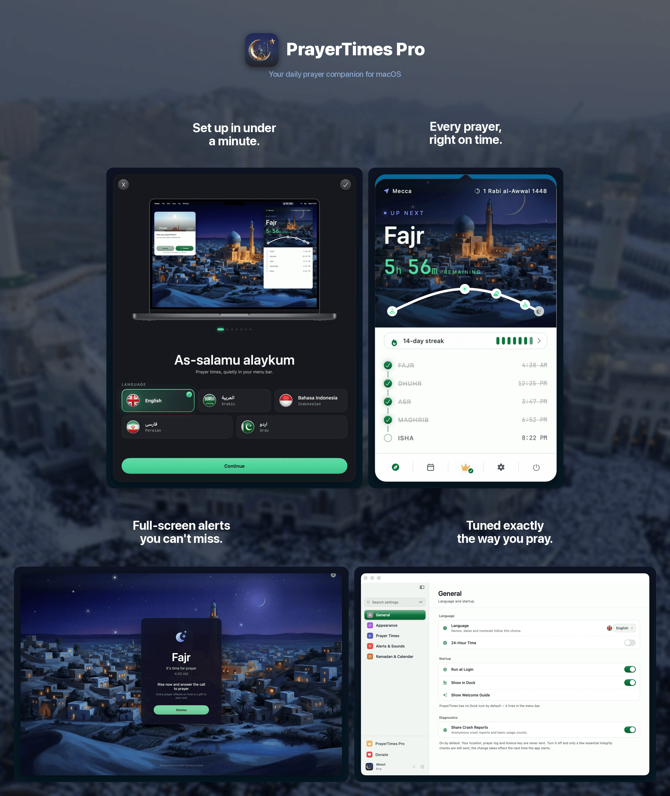
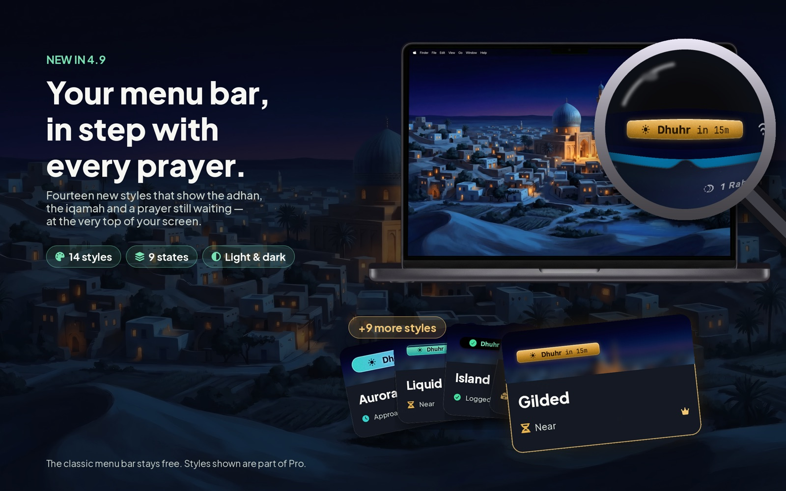
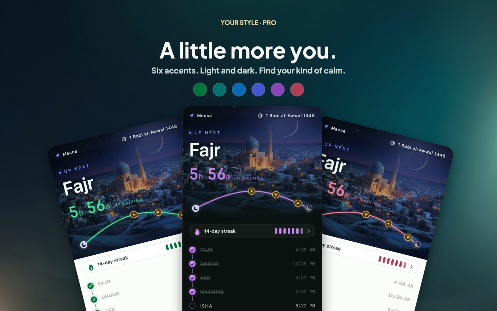
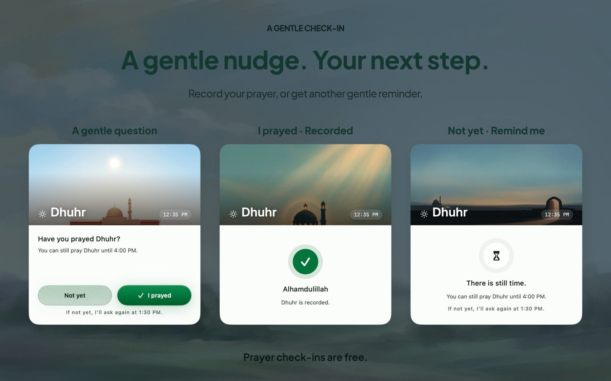
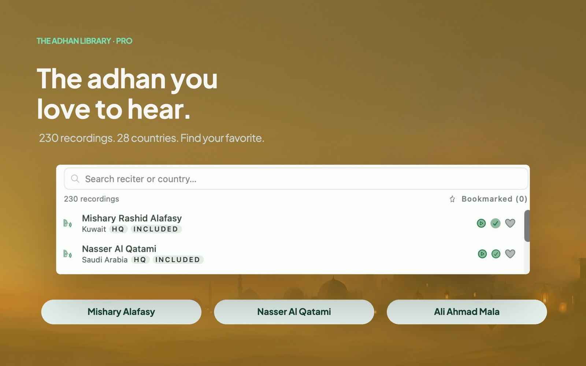

<!-- BEGIN abd3lraouf-studios:hero -->

    <strong>English</strong> | <a href="README.ar.md">العربية</a> | <a href="README.fa.md">فارسی</a> | <a href="README.id.md">Bahasa Indonesia</a> | <a href="README.ur.md">اردو</a>

    

<h1 align="center">PrayerTimes Pro</h1>

    <strong>A minimalist, privacy-first Islamic prayer times app for your Mac's menu bar.</strong> 
    Offline prayer-time calculation · 26 methods · 5 languages · Apple Silicon & Intel

    

    <a href="https://abd3lraouf.dev/download/prayertimes/macos"><strong>Download the direct build →</strong></a>

    <a href="https://abd3lraouf.dev/projects/prayertimes/">abd3lraouf.dev/projects/prayertimes/</a>

<!-- END abd3lraouf-studios:hero -->

    
    

    
    
    
    

    

---

## Why PrayerTimes Pro?

- **Private by default** — no accounts, and nothing that follows you across apps or the web. Prayer times are calculated on your Mac, and your precise location is never transmitted. Anonymous diagnostics can be switched off under Settings → General → Diagnostics.
- **Designed for the menu bar** — always visible, never in the way. Countdown, exact time, compact, or icon-only.
- **Accurate worldwide** — 26 calculation methods, per-prayer adjustments, custom angles.
- **Offline-first** — prayer times are calculated on your Mac, so they keep working without a connection.

## A closer look

<table>
<tr>
<td width="50%" align="center"> <b>New in 4.9</b> — fourteen menu bar styles that show the adhan, the iqamah and a prayer still waiting.</td>
<td width="50%" align="center"> Six accent colours, in light and dark.</td>
</tr>
<tr>
<td width="50%" align="center"> A gentle check-in asks whether you have prayed.</td>
<td width="50%" align="center"> 230 adhan recordings from 28 countries.</td>
</tr>
</table>

## Install

**Requirements:** macOS 14 (Sonoma) or later · Apple Silicon & Intel

PrayerTimes Pro ships on two channels. Same app, same price — take whichever suits you.

**Mac App Store** — Apple handles the purchase and the updates.

**Direct download** — signed and notarized, updates itself, and Pro unlocks with a licence key that is yours to keep.

- [Download the latest DMG](https://abd3lraouf.dev/download/prayertimes/macos)
- Or with Homebrew: `brew install --cask abd3lraouf-studios/tap/prayertimes`

## Features

- Menu bar **countdown**, exact time, compact, or icon-only display
- **Notifications** before and at prayer time, with optional full-screen alerts
- **Fourteen menu bar styles** that show the adhan, the iqamah and a prayer still waiting at a glance — the classic menu bar stays free
- **Iqamah alert** — the iqamah plays a set number of minutes after the adhan, per prayer: a short "Qad qāmatis-ṣalāh" or a full iqamah from fifteen recordings
- **Prayer check-in** — a gentle window asks whether you have prayed, and asks again while the prayer is still open
- **Salawat reminder** — a recited "Allahumma salli ʿala Muhammad" at the interval you choose, silent during your quiet hours
- **Four painted skies** behind every prayer, and a calm full-screen clock for a spare display
- **26 calculation methods**: Muslim World League (MWL), ISNA, Egyptian General Authority, Umm al-Qura (Makkah), Diyanet (Turkey), Kemenag (Indonesia), Karachi, Tehran, Dubai, Qatar, Singapore, Kuwait, Algeria, France, Germany, Malaysia (JAKIM), and more
- **Auto or manual location** · per-prayer time adjustments to match your local mosque
- **Hijri calendar** with adjustable date and Islamic event notifications (Ramadan, Eid al-Fitr, Eid al-Adha, Islamic New Year, Day of Ashura, and more)
- **Ramadan mode**: Suhoor and Iftar notifications with pre-alerts
- **Prayer log** — mark each prayer as you pray it, with a Fajr-anchored day rollover, streaks, and make-up (qada) tracking
- **Sunnah & Nawāfil** tracking alongside the five obligatory prayers
- **Qibla compass** pointing to the Kaaba from wherever you are
- **Adhan library** — a catalogue of recordings from 28 countries, with a separate adhan for Fajr, quiet hours, snooze defaults, and per-prayer announcements
- **Bring your own muezzin** — use a recording you already love, give each prayer its own reciter, and trim it to begin where you want
- **A prayer-times widget** for your desktop and Notification Centre
- **iCloud sync** — your prayer log and preferences follow you between Macs, with an export and a year in review
- **Settings that find themselves** — a sidebar window with search across every pane
- **Locale-aware numerals** (Arabic-Indic, Extended Arabic-Indic, Western)
- **5 languages**: English, العربية, Bahasa Indonesia, فارسی, اردو — with full RTL support
- **Light/dark mode** follows your system, with an appearance override and accent colour picker
- **Accessible** — Dynamic Type, Increase Contrast and Reduce Motion respected app-wide

## Free and Pro

PrayerTimes Pro is free to download on either channel, and the heart of it stays free for good: the menu bar countdown, every one of the 26 calculation methods, per-prayer adjustments, notifications, full-screen alerts and the adhan itself, the Hijri calendar and its event reminders, Ramadan mode, the Qibla compass, marking each prayer as you pray it, the Siri and Shortcuts action, and both light and dark themes. That is a complete prayer times app, and it costs nothing.

The prayer check-in, the Salawat reminder, a short iqamah after each prayer and the classic menu bar are free too.

A **$4.99 one-time Pro unlock** adds three things:

- **The living sky** — an animated sky behind the countdown across four painted scenes, the sun’s path across the day, the Ramadan cannon, fourteen menu bar styles, a calm full-screen clock for a spare display, and every accent colour.
- **Every adhan and iqamah reciter** — the full adhan library recorded across 28 countries, a separate call for Fajr, every iqamah recording, and the spoken pre-prayer announcement voice.
- **Streaks and qada** — the streak calendar and your records, the Sunnah checklist, and the make-up ledger.

One payment, no subscription, no account. Bought on the App Store it stays with your Apple Account; bought for the direct build it stays with your licence key.

## Privacy

No advertising, no accounts, and nothing that tracks you across apps or the web. Prayer times are calculated entirely on your Mac, and your **precise** location is never transmitted. What does leave the Mac: anonymous usage counts — never your location or your prayer log, and all of it off in one tap under Settings → General → Diagnostics. If you switch on iCloud sync, your prayer log and preferences also travel through **your own** iCloud to your other Macs — never through a server of ours. It is off until you turn it on.

To show a city name rather than raw coordinates, the app rounds your position to ~1.1 km and asks Apple's geocoder for a name. Sending that coarsened coordinate to **OpenStreetMap Nominatim** instead — which Indonesian, Persian and Urdu need for a correctly-written name — is **off by default** and opt-in under Settings → Prayer Times → Location. Typing a city into the location picker sends the text you typed. Pro adhan clips download on demand from the Internet Archive. App Store builds are updated through the App Store; the direct build checks for its own updates.

## What you can do here

- 🐛 [**Issues**](https://github.com/abd3lraouf-studios/PrayerTimes/issues) — report a bug or request a feature, or [create a new one](https://github.com/abd3lraouf-studios/PrayerTimes/issues/new/choose).
- 💬 [**Discussions**](https://github.com/abd3lraouf-studios/PrayerTimes/discussions) — ask questions, share ideas, and chat with other users.
- 📚 [**Wiki**](https://github.com/abd3lraouf-studios/PrayerTimes/wiki) — guides, FAQ, and shared knowledge.

If you have a problem or a request, search [Issues](https://github.com/abd3lraouf-studios/PrayerTimes/issues) first, then [open a new one](https://github.com/abd3lraouf-studios/PrayerTimes/issues/new/choose). For general chat that doesn't fit as an issue, head to [Discussions](https://github.com/abd3lraouf-studios/PrayerTimes/discussions).

## Support development

PrayerTimes Pro is built and maintained by one developer in their spare time. If it's useful to you, please consider supporting development:

    
    
    

Every contribution — no matter how small — helps keep the app actively developed and free of ads, trackers, and accounts.

<!-- BEGIN abd3lraouf-studios:press -->
## Press & marketing assets

PrayerTimes Pro keeps accurate prayer times a glance away in the macOS menu bar, with twenty-six calculation methods, five languages and a prayer log, computed on the Mac itself. It is free on the Mac App Store and as a direct download, and a $4.99 one-time Pro unlock adds the living sky, every adhan reciter, and streaks and qada.

**Naming.** Written "PrayerTimes Pro" — one word for the product name, capital P and T, with "Pro" as a separate word. Never "Prayer Times" or "Prayertimes".

The press kit — icons, screen art, boilerplate, the fact sheet and a downloadable
archive — is at **[abd3lraouf.dev/press/prayertimes/](https://abd3lraouf.dev/press/prayertimes/)**.
<!-- END abd3lraouf-studios:press -->

## License

PrayerTimes Pro is **closed source**. This repository hosts issues, discussions, and press assets only. The application is distributed under its own End User License Agreement — see the [Mac App Store listing](https://apps.apple.com/eg/app/prayer-times-pro-menubar/id6763390896?mt=12) or the [product page](https://abd3lraouf.dev/projects/prayertimes/).
