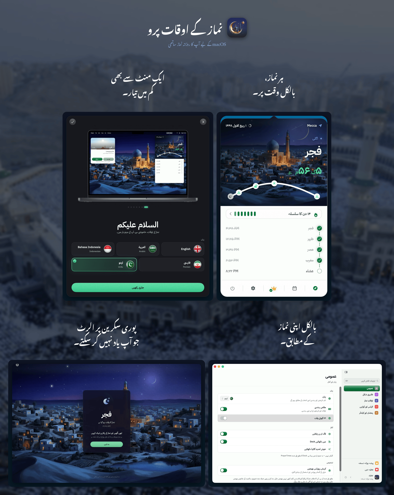

<!-- BEGIN abd3lraouf-studios:hero -->

    <a href="README.md">English</a> | <a href="README.ar.md">العربية</a> | <a href="README.fa.md">فارسی</a> | <a href="README.id.md">Bahasa Indonesia</a> | <strong>اردو</strong>

    

<h1 align="center">نماز کے اوقات پرو</h1>

    <strong>آپ کے میک کے مینو بار میں رہنے والی ایک سادہ، رازداری کو اولیت دینے والی اسلامی نماز کے اوقات کی ایپ۔</strong> 
    نماز کے اوقات کا آف لائن حساب · 26 طریقے · 5 زبانیں · Apple Silicon اور Intel

    

    <a href="https://abd3lraouf.dev/download/prayertimes/macos"><strong>براہِ راست نسخہ ڈاؤن لوڈ کریں →</strong></a>

    <a href="https://abd3lraouf.dev/projects/prayertimes/">abd3lraouf.dev/projects/prayertimes/</a>

<!-- END abd3lraouf-studios:hero -->

    
    

    
    
    
    

    

---

## نماز کے اوقات پرو ہی کیوں؟

- **بطورِ طے شدہ نجی** — کوئی اکاؤنٹ نہیں، اور ایسی کوئی چیز نہیں جو ایپس یا ویب پر آپ کا پیچھا کرے۔ نماز کے اوقات آپ کے میک پر شمار ہوتے ہیں، اور آپ کا درست مقام کبھی نہیں بھیجا جاتا۔ گمنام تشخیص کو ترتیبات ← عمومی ← تشخیص سے بند کیا جا سکتا ہے۔
- **مینو بار کے لیے ڈیزائن** — ہمیشہ نظر میں، کبھی راستے میں نہیں۔ کاؤنٹ ڈاؤن، صحیح وقت، مختصر، یا صرف آئیکن۔
- **دنیا بھر میں درست** — حساب کے 26 طریقے، فی نماز ایڈجسٹمنٹس، حسبِ ضرورت زاویے۔
- **آف لائن-فرسٹ** — نماز کے اوقات آپ کے Mac پر حساب ہوتے ہیں، اس لیے یہ کنکشن کے بغیر بھی کام کرتے ہیں۔

## قریب سے ایک نظر

<table>
<tr>
<td width="50%" align="center"> <b>4.9 میں نیا</b> — مینو بار کے چودہ انداز جو اذان، اقامت اور ابھی تک درج نہ ہونے والی نماز دکھاتے ہیں۔</td>
<td width="50%" align="center"> چھ نمایاں رنگ، روشن اور تاریک دونوں میں۔</td>
</tr>
<tr>
<td width="50%" align="center"> ایک نرم سی ونڈو پوچھتی ہے کہ کیا آپ نے نماز پڑھ لی۔</td>
<td width="50%" align="center"> 28 ممالک سے اذان کی 230 ریکارڈنگز۔</td>
</tr>
</table>

## انسٹالیشن

**ضروریات:** macOS 14 (Sonoma) یا اس سے نیا · Apple Silicon اور Intel

نماز کے اوقات پرو دو راستوں سے دستیاب ہے۔ ایک ہی ایپ، ایک ہی قیمت — جو آپ کو مناسب لگے وہ لے لیجیے۔

**Mac App Store** — خریداری اور اپڈیٹس Apple سنبھالتا ہے۔

**براہِ راست ڈاؤن لوڈ** — دستخط شدہ اور نوٹرائزڈ، خود کو اپڈیٹ کرتی ہے، اور پرو ایک لائسنس کلید سے کھلتا ہے جو آپ ہی کے پاس رہتی ہے۔

- [تازہ ترین DMG ڈاؤن لوڈ کریں](https://abd3lraouf.dev/download/prayertimes/macos)
- یا Homebrew کے ذریعے: `brew install --cask abd3lraouf-studios/tap/prayertimes`

## خصوصیات

- مینو بار میں **کاؤنٹ ڈاؤن**، صحیح وقت، مختصر، یا صرف آئیکن
- نماز سے پہلے اور نماز کے وقت **اطلاعات**، اختیاری فل اسکرین الرٹس کے ساتھ
- **مینو بار کے چودہ انداز** جو اذان، اقامت اور ابھی تک درج نہ ہونے والی نماز ایک نظر میں دکھاتے ہیں — کلاسک مینو بار مفت رہتا ہے
- **اقامت الرٹ** — ہر نماز کے لیے اذان کے بعد آپ کے چنے ہوئے منٹوں پر اقامت چلتی ہے: مختصر «قد قامت الصلاۃ»، یا پندرہ ریکارڈنگز میں سے مکمل اقامت
- **نماز کا چیک اِن** — ایک نرم سی ونڈو پوچھتی ہے کہ کیا آپ نے نماز پڑھ لی، اور جب تک نماز کا وقت باقی ہو دوبارہ پوچھتی ہے
- **درود کی یاد دہانی** — آپ کے چنے ہوئے وقفے پر «اللهم صلِّ على محمد» کی آواز، خاموشی کے اوقات میں خاموش
- **چار مصوّر آسمان** ہر نماز کے پیچھے، اور اضافی اسکرین کے لیے ایک پُرسکون فل اسکرین گھڑی
- **حساب کے 26 طریقے**: مسلم ورلڈ لیگ (MWL)، ISNA، مصری جنرل اتھارٹی، ام القری (مکہ)، دیانیت (ترکی)، کیمیناگ (انڈونیشیا)، کراچی، تہران، دبئی، قطر، سنگاپور، کویت، الجزائر، فرانس، جرمنی، ملائیشیا (JAKIM)، اور مزید
- **خودکار یا دستی مقام** · مقامی مسجد سے مماثلت کے لیے فی نماز وقت کی ایڈجسٹمنٹ
- **ہجری کیلنڈر** قابل ایڈجسٹ تاریخ اور اسلامی واقعات کی اطلاعات کے ساتھ (رمضان، عید الفطر، عید الاضحیٰ، اسلامی نیا سال، یوم عاشورا، اور مزید)
- **رمضان موڈ**: سحری اور افطار کی اطلاعات پری-الرٹس کے ساتھ
- **نماز کا ریکارڈ** — ہر نماز ادا کرتے ہی نشان لگائیں، فجر سے شروع ہوتے دن، تسلسل (streak)، اور قضا کی پیروی کے ساتھ
- **سنن و نوافل** پانچ فرض نمازوں کے ساتھ ساتھ
- **قبلہ نما** جو آپ جہاں بھی ہوں کعبہ کی سمت بتائے
- **اذان کی لائبریری** — 28 ممالک کی ریکارڈنگز کا مجموعہ، فجر کے لیے الگ اذان، خاموشی کے اوقات، اسنوز کی ترتیبات، اور فی نماز اعلان کے ساتھ
- **اپنا مؤذن لائیے** — جو ریکارڈنگ آپ کو پسند ہو وہ استعمال کریں، ہر نماز کے لیے الگ مؤذن چنیں، اور اس کا آغاز جہاں چاہیں سے کریں
- **نماز کے اوقات کا وجیٹ** آپ کے ڈیسک ٹاپ اور نوٹیفکیشن سینٹر کے لیے
- **iCloud سِنک** — آپ کا نماز کا ریکارڈ اور ترجیحات میک کے درمیان ساتھ چلتی ہیں، ایکسپورٹ اور سال کے جائزے کے ساتھ
- **ترتیبات جو خود مل جائیں** — سائیڈبار والی ونڈو اور ہر پین میں تلاش
- **مقام کے مطابق ہندسے** (عربی-ہندی، توسیع شدہ عربی-ہندی، مغربی)
- **5 زبانیں**: English، العربية، Bahasa Indonesia، فارسی، اردو — مکمل RTL سپورٹ کے ساتھ
- **روشن/گہرا موڈ** آپ کے سسٹم کے مطابق، ظاہری وضع تبدیل کرنے اور ایکسنٹ رنگ چننے کی سہولت کے ساتھ
- **قابلِ رسائی** — Dynamic Type، Increase Contrast اور Reduce Motion پوری ایپ میں ملحوظ

## مفت اور پرو

نماز کے اوقات پرو دونوں راستوں سے ڈاؤن لوڈ کرنا مفت ہے، اور ایپ کا اصل حصہ ہمیشہ مفت رہے گا: مینو بار کا کاؤنٹ ڈاؤن، تمام حساب کے 26 طریقے، فی نماز ایڈجسٹمنٹس، اطلاعات، فل اسکرین الرٹس اور خود اذان، ہجری کیلنڈر اور اس کی واقعاتی یاد دہانیاں، رمضان موڈ، قبلہ نما، ہر نماز پڑھتے ہی اسے نشان زد کرنا، Siri اور Shortcuts کا عمل، اور روشن و تاریک دونوں تھیمز۔ یہ بذاتِ خود ایک مکمل نماز کے اوقات کی ایپ ہے، اور اس کی کوئی قیمت نہیں۔

نماز کا چیک اِن، درود کی یاد دہانی، ہر نماز کے بعد مختصر اقامت اور کلاسک مینو بار بھی مفت ہیں۔

**14.99 ڈالر کا ایک بار کا پرو اَن لاک** تین چیزیں شامل کرتا ہے:

- **زندہ آسمان** — کاؤنٹ ڈاؤن کے پیچھے چار مصوّر مناظر میں متحرک آسمان، دن بھر سورج کے راستے کا قوس، رمضان کی توپ، مینو بار کے چودہ انداز، اضافی اسکرین کے لیے پُرسکون فل اسکرین گھڑی، اور تمام ایکسنٹ رنگ۔
- **ہر مؤذن اور ہر اقامت** — 28 ممالک میں ریکارڈ کی گئی اذان کی مکمل لائبریری، فجر کے لیے الگ اذان، اقامت کی تمام ریکارڈنگز، اور نماز سے پہلے بولی جانے والی اطلاع کی آواز۔
- **تسلسل اور قضا** — تسلسل کا کیلنڈر اور آپ کا ریکارڈ، سنتوں کی فہرست، اور قضا کا کھاتہ۔

ایک ادائیگی، کوئی سبسکرپشن نہیں، کوئی اکاؤنٹ نہیں۔ App Store سے خریدیں تو یہ آپ کے Apple اکاؤنٹ کے ساتھ رہتا ہے؛ براہِ راست نسخے کے لیے خریدیں تو آپ کی لائسنس کلید کے ساتھ۔

## رازداری

کوئی اشتہارات نہیں، کوئی اکاؤنٹ نہیں، اور ایسی کوئی چیز نہیں جو ایپس یا ویب پر آپ کا پیچھا کرے۔ نماز کے اوقات مکمل طور پر آپ کے میک پر شمار ہوتے ہیں، اور آپ کا **درست** مقام کبھی نہیں بھیجا جاتا۔ جو چیز واقعی جاتی ہے: دونوں بلڈز سے گمنام استعمال کی گنتی، اور براہِ راست ڈاؤن لوڈ سے گمنام کریش رپورٹس — کبھی آپ کا مقام، نماز کا ریکارڈ یا لائسنس کی کلید نہیں، اور یہ سب ترتیبات ← عمومی ← تشخیص سے ایک ٹیپ میں بند ہو جاتا ہے۔ اگر آپ iCloud سِنک آن کریں تو آپ کا نماز کا ریکارڈ اور ترجیحات بھی **آپ کے اپنے** iCloud کے ذریعے آپ کے دوسرے میک تک جاتی ہیں — ہمارے کسی سرور کے ذریعے نہیں۔ جب تک آپ خود آن نہ کریں یہ بند رہتی ہے۔

خام کوآرڈینیٹس کے بجائے شہر کا نام دکھانے کے لیے ایپ آپ کی پوزیشن کو ~1.1 کلومیٹر تک گول کر کے Apple کے جیو کوڈر سے نام مانگتی ہے۔ اسی گول کیے گئے کوآرڈینیٹ کو **OpenStreetMap Nominatim** کو بھیجنا — جس کی ضرورت انڈونیشی، فارسی اور اردو کو درست املا والے نام کے لیے ہوتی ہے — **بطورِ طے شدہ بند ہے** اور «اوقاتِ نماز ← مقام» سے فعال کیا جا سکتا ہے۔ مقام منتخب کرنے والے میں شہر لکھتے وقت صرف وہی متن بھیجا جاتا ہے جو آپ لکھتے ہیں۔ پرو اذان کلپس ضرورت کے مطابق Internet Archive سے ڈاؤن لوڈ ہوتے ہیں۔ App Store کا نسخہ App Store کے ذریعے اپڈیٹ ہوتا ہے، جبکہ براہِ راست نسخہ اپنی اپڈیٹس خود دیکھتا ہے۔

## یہاں آپ کیا کر سکتے ہیں

- 🐛 [**Issues**](https://github.com/abd3lraouf-studios/PrayerTimes/issues) — بگ رپورٹ کریں یا فیچر کی درخواست کریں، یا [نیا بنائیں](https://github.com/abd3lraouf-studios/PrayerTimes/issues/new/choose)۔
- 💬 [**Discussions**](https://github.com/abd3lraouf-studios/PrayerTimes/discussions) — سوالات پوچھیں، خیالات کا اشتراک کریں، اور دیگر صارفین سے بات چیت کریں۔
- 📚 [**Wiki**](https://github.com/abd3lraouf-studios/PrayerTimes/wiki) — گائیڈز، اکثر پوچھے گئے سوالات، اور مشترکہ معلومات۔

اگر آپ کو مسئلہ ہو یا درخواست ہو، پہلے [Issues](https://github.com/abd3lraouf-studios/PrayerTimes/issues) میں تلاش کریں، پھر [نیا کھولیں](https://github.com/abd3lraouf-studios/PrayerTimes/issues/new/choose)۔ عمومی بات چیت کے لیے [Discussions](https://github.com/abd3lraouf-studios/PrayerTimes/discussions) پر جائیں۔

## ترقی کی حمایت کریں

نماز کے اوقات پرو کو ایک ڈویلپر اپنے فارغ وقت میں بناتا اور برقرار رکھتا ہے۔ اگر یہ آپ کے لیے مفید ہے تو براہِ کرم ترقی کی حمایت کرنے پر غور کریں:

    
    
    

ہر تعاون — چاہے کتنا ہی چھوٹا ہو — ایپ کو فعال طور پر ترقی پذیر اور اشتہارات، ٹریکرز اور اکاؤنٹس سے پاک رکھنے میں مدد دیتا ہے۔

## پریس اور مارکیٹنگ مواد

پریس کٹ — آئیکنز، اسکرین آرٹ، تعارفی متن، فیکٹ شیٹ اور ڈاؤن لوڈ کے قابل آرکائیو — **[abd3lraouf.dev/press/prayertimes/](https://abd3lraouf.dev/press/prayertimes/)** پر دستیاب ہے۔

## لائسنس

نماز کے اوقات پرو **بند سورس (closed source)** ہے۔ یہ ریپوزٹری صرف Issues، Discussions اور پریس مواد کی میزبانی کرتی ہے۔ ایپلیکیشن اپنے End User License Agreement کے تحت تقسیم کی جاتی ہے — [Mac App Store لسٹنگ](https://apps.apple.com/eg/app/prayer-times-pro-menubar/id6763390896?mt=12) یا [پروڈکٹ صفحہ](https://abd3lraouf.dev/projects/prayertimes/) دیکھیں۔
