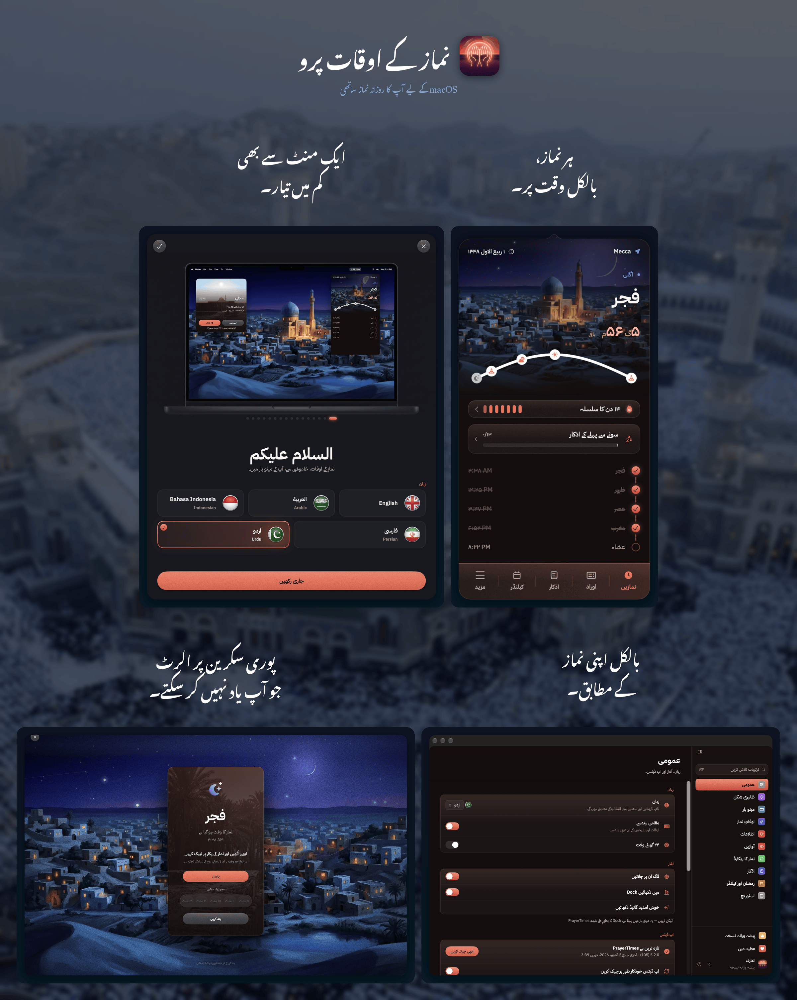

<!-- BEGIN abd3lraouf-studios:hero -->

    <a href="README.md">English</a> | <a href="README.ar.md">العربية</a> | <a href="README.fa.md">فارسی</a> | <a href="README.id.md">Bahasa Indonesia</a> | <strong>اردو</strong>

    

<h1 align="center">نماز کے اوقات پرو</h1>

    <strong>آپ کے میک کے مینو بار میں رہنے والی ایک سادہ، رازداری کو اولیت دینے والی اسلامی نماز کے اوقات کی ایپ۔</strong> 
    نماز کے اوقات کا آف لائن حساب · 26 طریقے · 5 زبانیں · Apple Silicon اور Intel

    

    <a href="https://abd3lraouf.dev/download/prayertimes/macos"><strong>براہِ راست نسخہ ڈاؤن لوڈ کریں →</strong></a>

    <a href="https://abd3lraouf.dev/projects/prayertimes/">abd3lraouf.dev/projects/prayertimes/</a>

<!-- END abd3lraouf-studios:hero -->

    
    

    
    
    
    

    

---

## نماز کے اوقات پرو ہی کیوں؟

- **بطورِ طے شدہ نجی** — کوئی اکاؤنٹ نہیں، اور ایسی کوئی چیز نہیں جو ایپس یا ویب پر آپ کا پیچھا کرے۔ نماز کے اوقات آپ کے میک پر شمار ہوتے ہیں، اور آپ کا درست مقام کبھی نہیں بھیجا جاتا۔ گمنام تشخیص کو ترتیبات ← عمومی ← تشخیص سے بند کیا جا سکتا ہے۔
- **مینو بار کے لیے ڈیزائن** — ہمیشہ نظر میں، کبھی راستے میں نہیں۔ کاؤنٹ ڈاؤن، صحیح وقت، مختصر، یا صرف آئیکن۔
- **دنیا بھر میں درست** — حساب کے 26 طریقے، فی نماز ایڈجسٹمنٹس، حسبِ ضرورت زاویے۔
- **آف لائن-فرسٹ** — نماز کے اوقات آپ کے Mac پر حساب ہوتے ہیں، اس لیے یہ کنکشن کے بغیر بھی کام کرتے ہیں۔

## قریب سے ایک نظر

<table>
<tr>
<td width="50%" align="center"> <b>5.2 میں نیا</b> — خوبصورت آسمان، آپ کے میک پر ہلکا۔</td>
<td width="50%" align="center"> <b>5.2 میں نیا</b> — آپ کی اگلی نماز یہیں سے شروع ہوتی ہے۔</td>
</tr>
<tr>
<td width="50%" align="center"> کام کرتے ہوئے کوئی نماز نہ چھوٹے۔</td>
<td width="50%" align="center"> ہمیشہ جانیں کہ کتنا وقت باقی ہے۔</td>
</tr>
<tr>
<td width="50%" align="center"> ہر روز، نماز وقت پر۔</td>
<td width="50%" align="center"> سفر میں ہیں؟ قصر اب آسان۔</td>
</tr>
<tr>
<td width="50%" align="center"> اپنے اذکار کبھی نہ چھوڑیں۔</td>
<td width="50%" align="center"> نفلی روزے، بالکل وقت پر۔</td>
</tr>
<tr>
<td width="50%" align="center"> 28 ممالک سے 230 اذانیں۔</td>
<td width="50%" align="center"> آپ کا روزانہ کا وِرد، ایک ہی جگہ۔</td>
</tr>
</table>

## انسٹالیشن

**ضروریات:** macOS 14 (Sonoma) یا اس سے نیا · Apple Silicon اور Intel

نماز کے اوقات پرو دو راستوں سے دستیاب ہے۔ ایک ہی ایپ، ایک ہی قیمت — جو آپ کو مناسب لگے وہ لے لیجیے۔

**براہِ راست ڈاؤن لوڈ** — دستخط شدہ اور نوٹرائزڈ، خود کو اپڈیٹ کرتی ہے، اور پرو ایک لائسنس کلید سے کھلتا ہے جو آپ ہی کے پاس رہتی ہے، زیادہ سے زیادہ تین میک پر۔

- [تازہ ترین DMG ڈاؤن لوڈ کریں](https://abd3lraouf.dev/download/prayertimes/macos)
- یا Homebrew کے ذریعے: `brew install --cask abd3lraouf-studios/tap/prayertimes`

**Mac App Store** — خریداری اور اپڈیٹس Apple سنبھالتا ہے۔

## خصوصیات

### نماز کے اوقات

- مینو بار میں **کاؤنٹ ڈاؤن**، صحیح وقت، مختصر، یا صرف آئیکن
- **مینو بار کے چودہ انداز** جو اذان، اقامت اور ابھی تک درج نہ ہونے والی نماز ایک نظر میں دکھاتے ہیں — کلاسک مینو بار مفت رہتا ہے، اور قضا نمازوں کی سرخ گنتی چھپائی جا سکتی ہے
- **حساب کے 26 طریقے**: مسلم ورلڈ لیگ (MWL)، ISNA، مصری جنرل اتھارٹی، ام القری (مکہ)، دیانیت (ترکی)، کیمیناگ (انڈونیشیا)، کراچی، تہران، دبئی، قطر، سنگاپور، کویت، الجزائر، فرانس، جرمنی، ملائیشیا (JAKIM)، اور مزید
- **خودکار یا دستی مقام** · مقامی مسجد سے مماثلت کے لیے فی نماز وقت کی ایڈجسٹمنٹ
- **ہجری کیلنڈر** قابل ایڈجسٹ تاریخ اور اسلامی واقعات کی اطلاعات کے ساتھ (رمضان، عید الفطر، عید الاضحیٰ، اسلامی نیا سال، یوم عاشورا، اور مزید)، اور آپ کے اختیار کردہ سنت روزے اس پر نشان زد
- **رمضان موڈ**: سحری اور افطار کی اطلاعات پری-الرٹس کے ساتھ
- **قبلہ نما** جو آپ جہاں بھی ہوں کعبہ کی سمت بتائے
- **نماز کے اوقات کا وجیٹ** آپ کے ڈیسک ٹاپ اور نوٹیفکیشن سینٹر کے لیے

### اذان اور اقامت

- نماز سے پہلے اور نماز کے وقت **اطلاعات**، اختیاری فل اسکرین الرٹس کے ساتھ، جو اذان ختم ہونے تک اسکرین پر رہتا ہے
- **اذان کی لائبریری** — 28 ممالک کی ریکارڈنگز کا مجموعہ، فجر کے لیے الگ اذان، خاموشی کے اوقات، اسنوز کی ترتیبات، اور فی نماز اعلان کے ساتھ
- **اپنا مؤذن لائیے** — جو ریکارڈنگ آپ کو پسند ہو وہ استعمال کریں، ہر نماز کے لیے الگ مؤذن چنیں، اور اس کا آغاز جہاں چاہیں سے کریں
- **اقامت الرٹ** — ہر نماز کے لیے اذان کے بعد آپ کے چنے ہوئے منٹوں پر اقامت چلتی ہے: مختصر «قد قامت الصلاۃ»، یا پندرہ ریکارڈنگز میں سے مکمل اقامت
- **ہر پکار کے لیے روکنے کا بٹن** — جب بھی اذان یا اقامت چل رہی ہو، ایک چھوٹا کنٹرول اسے روکنے کے بٹن کے ساتھ دکھاتا ہے، اور ⌘. کسی بھی ایپ سے اسے روک دیتا ہے
- **اذان کے لیے خاموشی** — اذان اور اقامت کے دوران Music، TV اور Spotify رک جاتے ہیں اور بعد میں چلتے ہیں، اور کال کے دوران نماز کا وقت ایک خاموش اطلاع کی صورت میں آتا ہے

### آپ کی روزانہ عبادت

- **نماز کا ریکارڈ** — ہر نماز ادا کرتے ہی نشان لگائیں، فجر سے شروع ہوتے دن، تسلسل (streak)، اور قضا کی پیروی کے ساتھ
- **نماز کا چیک اِن** — ایک نرم سی ونڈو پوچھتی ہے کہ کیا آپ نے نماز پڑھ لی، اور جب تک نماز کا وقت باقی ہو دوبارہ پوچھتی ہے
- **سنن و نوافل** پانچ فرض نمازوں کے ساتھ ساتھ
- **اذکار** — صبح، شام، نماز کے بعد اور سونے کے اذکار، اور پورا حصن المسلم، ساتھ ساتھ گنتی اور لفظ بہ لفظ تلاوت کے ساتھ؛ اور اپنی پسند کے شارٹ کٹ سے کسی بھی ایپ سے تسبیح گنیں
- **روزانہ اوراد** — آپ کے اذکار، قرآن کے صفحات اور تسبیح ایک روزانہ ورد میں، اس کے اپنے پلیئر کے ساتھ
- **ختم کا منصوبہ** — کسی تاریخ یا رمضان کے آخر تک، آج کے صفحات اور اپنی رفتار کے ساتھ، اور ہفتے اور مہینے کی رپورٹ جو آپ شیئر کر سکیں
- **نفلی روزے اور جمعہ** — پیر، جمعرات، ایامِ بیض، عرفہ اور عاشوراء سے پہلے کی شام یاد دہانی، نیت کیے گئے روزے پر سحری اور افطار کے الرٹ، اور جمعہ کی الکہف، غسل اور قبولیت کی گھڑی
- **سفر موڈ** — گھر سے دور یہ پوچھتا ہے کہ آپ کتنا ٹھہریں گے اور آپ کے مسلک (شافعی، مالکی، حنبلی، حنفی یا عرف) کے مطابق قصر نمازیں دکھاتا ہے؛ ایک ٹیپ جمع کی گئی نمازیں ایک ساتھ درج کرتا ہے
- **نماز کے گرد منظم دن** — آپ کی میٹنگز کے درمیان ہر نماز کے لیے وقفہ، اور یاد دہانی کے پروفائل جو دن اور وقت کے مطابق بدلتے ہیں
- **درود کی یاد دہانی** — آپ کے چنے ہوئے وقفے پر «اللهم صلِّ على محمد» کی آواز، خاموشی کے اوقات میں خاموش

### ظاہری شکل اور انداز

- **زندہ آسمان** — ہر نماز کے پیچھے دن کے سات اوقات میں چار مصوّر مناظر، اب آپ کے میک پر ہلکے، اور اضافی اسکرین کے لیے پُرسکون فل اسکرین گھڑی
- **لیکوئڈ گلاس** macOS Tahoe پر، اُس گھڑی کے رنگ میں
- **روشن/گہرا موڈ** آپ کے سسٹم کے مطابق، ظاہری وضع تبدیل کرنے اور ایکسنٹ رنگ چننے کی سہولت کے ساتھ
- **ترتیبات جو خود مل جائیں** — سائیڈبار والی ونڈو اور ہر پین میں تلاش
- **iCloud سِنک** — آپ کا نماز کا ریکارڈ اور ترجیحات میک کے درمیان ساتھ چلتی ہیں، ایکسپورٹ اور سال کے جائزے کے ساتھ
- **Siri، Shortcuts اور فوکس** — Shortcuts کے ایکشنز، اور ایک فوکس جو یاد دہانیاں خاموش کر دیتا ہے
- **5 زبانیں**: English، العربية، Bahasa Indonesia، فارسی، اردو — مکمل RTL سپورٹ کے ساتھ
- **مقام کے مطابق ہندسے** (عربی-ہندی، توسیع شدہ عربی-ہندی، مغربی)
- **قابلِ رسائی** — Dynamic Type، Increase Contrast اور Reduce Motion پوری ایپ میں ملحوظ

## مفت اور پرو

نماز کے اوقات پرو دونوں راستوں سے ڈاؤن لوڈ کرنا مفت ہے، اور ایپ کا اصل حصہ ہمیشہ مفت رہے گا: مینو بار کا کاؤنٹ ڈاؤن، تمام حساب کے 26 طریقے، فی نماز ایڈجسٹمنٹس، اطلاعات، فل اسکرین الرٹس اور خود اذان، روکنے کا بٹن، ہجری کیلنڈر اور اس کی واقعاتی اور نفلی روزوں کی یاد دہانیاں، رمضان موڈ، قبلہ نما، ہر نماز پڑھتے ہی اسے نشان زد کرنا، ایک قاری کے ساتھ اذکار، تسبیح کا شارٹ کٹ، اذان کے دوران موسیقی روکنا، Siri اور Shortcuts، لیکوئڈ گلاس، اور روشن و تاریک دونوں تھیمز۔ یہ بذاتِ خود ایک مکمل نماز کے اوقات کی ایپ ہے، اور اس کی کوئی قیمت نہیں۔

نماز کا چیک اِن، درود کی یاد دہانی، ہر نماز کے بعد مختصر اقامت اور کلاسک مینو بار بھی مفت ہیں۔

**14.99 ڈالر کا ایک بار کا پرو اَن لاک** یہ شامل کرتا ہے:

- **زندہ آسمان** — کاؤنٹ ڈاؤن کے پیچھے چار مصوّر مناظر میں متحرک آسمان، دن بھر سورج کے راستے کا قوس، رمضان کی توپ، مینو بار کے چودہ انداز، اضافی اسکرین کے لیے پُرسکون فل اسکرین گھڑی، اور تمام ایکسنٹ رنگ۔
- **ہر آواز** — 28 ممالک میں ریکارڈ کی گئی اذان کی مکمل لائبریری، فجر کے لیے الگ اذان، اقامت کی تمام ریکارڈنگز، نماز سے پہلے بولی جانے والی اطلاع کی آواز، اور اذکار کے تمام قاری۔
- **تسلسل اور قضا** — تسلسل کا کیلنڈر اور آپ کا ریکارڈ، سنتوں کی فہرست، اور قضا کا کھاتہ۔
- **آپ کی روزانہ عبادت** — روزانہ اوراد، ختم کا منصوبہ، اور ہفتے اور مہینے کی رپورٹ۔
- **سفر اور کام کا دن** — سفر موڈ، آپ کی میٹنگز کے درمیان ہر نماز کے لیے وقفہ، اور دن اور وقت کے مطابق یاد دہانی کے پروفائل۔

ایک ادائیگی، کوئی سبسکرپشن نہیں، کوئی اکاؤنٹ نہیں۔ براہِ راست نسخے کے لیے خریدیں تو یہ آپ کی لائسنس کلید کے ساتھ رہتا ہے، زیادہ سے زیادہ تین میک پر؛ App Store سے خریدیں تو آپ کے Apple اکاؤنٹ کے ساتھ۔

## رازداری

کوئی اشتہارات نہیں، کوئی اکاؤنٹ نہیں، اور ایسی کوئی چیز نہیں جو ایپس یا ویب پر آپ کا پیچھا کرے۔ نماز کے اوقات مکمل طور پر آپ کے میک پر شمار ہوتے ہیں، اور آپ کا **درست** مقام کبھی نہیں بھیجا جاتا۔ جو چیز واقعی جاتی ہے: دونوں بلڈز سے گمنام استعمال کی گنتی، اور براہِ راست ڈاؤن لوڈ سے گمنام کریش رپورٹس — کبھی آپ کا مقام، نماز کا ریکارڈ یا لائسنس کی کلید نہیں، اور یہ سب ترتیبات ← عمومی ← تشخیص سے ایک ٹیپ میں بند ہو جاتا ہے۔ اگر آپ iCloud سِنک آن کریں تو آپ کا نماز کا ریکارڈ اور ترجیحات بھی **آپ کے اپنے** iCloud کے ذریعے آپ کے دوسرے میک تک جاتی ہیں — ہمارے کسی سرور کے ذریعے نہیں۔ جب تک آپ خود آن نہ کریں یہ بند رہتی ہے۔

خام کوآرڈینیٹس کے بجائے شہر کا نام دکھانے کے لیے ایپ آپ کی پوزیشن کو ~1.1 کلومیٹر تک گول کر کے Apple کے جیو کوڈر سے نام مانگتی ہے۔ اسی گول کیے گئے کوآرڈینیٹ کو **OpenStreetMap Nominatim** کو بھیجنا — جس کی ضرورت انڈونیشی، فارسی اور اردو کو درست املا والے نام کے لیے ہوتی ہے — **بطورِ طے شدہ بند ہے** اور «اوقاتِ نماز ← مقام» سے فعال کیا جا سکتا ہے۔ مقام منتخب کرنے والے میں شہر لکھتے وقت صرف وہی متن بھیجا جاتا ہے جو آپ لکھتے ہیں۔ پرو آڈیو (اذان کلپس اور اذکار کے قاری) ضرورت کے مطابق ایپ کے اپنے سرور سے ڈاؤن لوڈ ہوتی ہے، جو پہلے آپ کا پرو فعال ہونا جانچتا ہے۔ براہِ راست نسخہ اپنی اپڈیٹس خود دیکھتا ہے، جبکہ App Store کا نسخہ App Store کے ذریعے اپڈیٹ ہوتا ہے۔

اذان کے دوران میڈیا روکنا اختیاری ہے۔ جب آپ رازداری اور حفاظت ← آٹومیشن میں اجازت دیں تو ایپ Music، TV یا Spotify سے — صرف وہ جو پہلے سے چل رہا ہو — پوچھتی ہے کہ کیا وہ چل رہا ہے، اور اسے روکنے اور دوبارہ چلانے کو کہتی ہے، اس کے سوا کچھ نہیں۔ سفر موڈ آپ کا گھر اور موجودہ مقام اسی میک پر رکھتا ہے؛ ان میں سے کوئی بھی سِنک یا بھیجا نہیں جاتا۔ میٹنگز کے درمیان ہر نماز کے لیے وقفہ ڈھونڈنے کے لیے ایپ آپ کا کیلنڈر اسی میک پر پڑھتی ہے، اور صرف آپ کی اجازت کے بعد؛ آپ کے کیلنڈر کے واقعات میک سے باہر نہیں جاتے۔

## یہاں آپ کیا کر سکتے ہیں

- 🐛 [**Issues**](https://github.com/abd3lraouf-studios/PrayerTimes/issues) — بگ رپورٹ کریں یا فیچر کی درخواست کریں، یا [نیا بنائیں](https://github.com/abd3lraouf-studios/PrayerTimes/issues/new/choose)۔
- 💬 [**Discussions**](https://github.com/abd3lraouf-studios/PrayerTimes/discussions) — سوالات پوچھیں، خیالات کا اشتراک کریں، اور دیگر صارفین سے بات چیت کریں۔
- 📚 [**Wiki**](https://github.com/abd3lraouf-studios/PrayerTimes/wiki) — گائیڈز، اکثر پوچھے گئے سوالات، اور مشترکہ معلومات۔

اگر آپ کو مسئلہ ہو یا درخواست ہو، پہلے [Issues](https://github.com/abd3lraouf-studios/PrayerTimes/issues) میں تلاش کریں، پھر [نیا کھولیں](https://github.com/abd3lraouf-studios/PrayerTimes/issues/new/choose)۔ عمومی بات چیت کے لیے [Discussions](https://github.com/abd3lraouf-studios/PrayerTimes/discussions) پر جائیں۔

## ترقی کی حمایت کریں

نماز کے اوقات پرو کو ایک ڈویلپر اپنے فارغ وقت میں بناتا اور برقرار رکھتا ہے۔ اگر یہ آپ کے لیے مفید ہے تو براہِ کرم ترقی کی حمایت کرنے پر غور کریں:

    
    
    

ہر تعاون — چاہے کتنا ہی چھوٹا ہو — ایپ کو فعال طور پر ترقی پذیر اور اشتہارات، ٹریکرز اور اکاؤنٹس سے پاک رکھنے میں مدد دیتا ہے۔

## پریس اور مارکیٹنگ مواد

پریس کٹ — آئیکنز، اسکرین آرٹ، تعارفی متن، فیکٹ شیٹ اور ڈاؤن لوڈ کے قابل آرکائیو — **[abd3lraouf.dev/press/prayertimes/](https://abd3lraouf.dev/press/prayertimes/)** پر دستیاب ہے۔

## لائسنس

نماز کے اوقات پرو **بند سورس (closed source)** ہے۔ یہ ریپوزٹری صرف Issues، Discussions اور پریس مواد کی میزبانی کرتی ہے۔ ایپلیکیشن اپنے End User License Agreement کے تحت تقسیم کی جاتی ہے — [Mac App Store لسٹنگ](https://apps.apple.com/eg/app/prayer-times-pro-menubar/id6763390896?mt=12) یا [پروڈکٹ صفحہ](https://abd3lraouf.dev/projects/prayertimes/) دیکھیں۔
